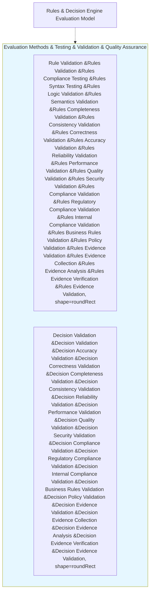

# KB-164 Rules & Decision Engine Architecture

## Metadata

* **Document ID:** KB-164
* **Title:** Rules & Decision Engine Architecture
* **Suite:** Enterprise Platform Services Architecture
* **Version:** 1.0
* **Status:** Approved Architecture
* **Classification:** Enterprise Rules & Decision Architecture

## Executive Summary

Define the canonical Rules & Decision Engine Architecture for DUKADESK.

The Enterprise Rules & Decision Engine Platform shall provide a comprehensive framework for rule management, decision making, policy evaluation, and intelligent decision support while ensuring enterprise alignment, scalability, governance, and continuous improvement across all DUKADESK operations.

Rules & decision engines shall operate as enterprise capabilities that enable consistent decision-making, policy enforcement, and intelligent automation across the entire DUKADESK ecosystem.

## Purpose

Define how DUKADESK standardizes and governs rules and decision engines, policy evaluation, decision modeling, rule governance, and rules and decision engine lifecycle while maintaining consistency, governance, and enterprise alignment across all decision-making domains.

## Scope

### Include:

* Rules and decision engine architecture
* Rules management platform
* Rules engine
* Decision engine
* Policy evaluation
* Decision modeling
* Rules governance
* Decision governance
* Rules analytics
* Decision analytics
* AI-assisted rules and decisions
* Rules exception handling
* Decision support systems
* Enterprise rules architecture
* Rules reusability
* Decision consistency

### Exclude:

* Rule-specific implementation details
* Decision-specific implementation details
* UI rules management
* Rules performance optimization
* Rules deployment specifics
* Rule access control rules
* Rule user interfaces

These are addressed by dedicated rules and decision engine specifications (KB-165 through KB-180).

## Architectural Principles

The specification shall define principles including:

Rules and decisions as enterprise capabilities
Rules standardization and reusability
decision consistency and standardization
evidence-based decision making
continuous decision improvement
decision transparency and auditability
Rules & decisions scalability and elasticity
decision-driven rule execution
innovation enablement
continuous decision evolution
Enterprise-first design
Rules & decisions compatibility
Enterprise rules & decisions security
Enterprise rules & decisions governance
Canonical Definitions

Define standardized terminology for:

Rules & Decision Engine
Rule Management
Decision Engine
Policy Evaluation
Decision Modeling
Rules Governance
Decision Governance
Rules Analytics
Decision Analytics
AI-Assisted Rules & Decisions
Enterprise Rules & Decisions Architecture
Rule Service Bus
Rules Engine
Decision Engine
Rules Repository
Rules Analytics
Architecture

Describe architectures for:

Enterprise Rules & Decision Engine Platform

Canonical architecture governing enterprise rules and decision engines.

Rules & Decision Engine Core Services

Reference architecture for core rules and decision engine services:

```mermaid
graph TB
    rules_engine["Enterprise Rules & Decision Engine Platform"]
    
    subgraph rules_management["Rules Management & Administration Services"]
        rules_editor["Rules Editor & Rules Definition & Business Rules Editor & Rules Authoring & Rules Documentation & Rules Validation & Rules Verification & Rules Completeness Checking"]
        rules_library["Rules Library & Reusable Rules & Rules Templates & Rules Repository & Rules Catalog & Rules Taxonomy & Rules Classification & Rules Hierarchies"]
        rules_validation["Rules Validation & Rules Validation & Rules Validation & Rules Syntax & Rules Semantics & Rules Consistency & Rules Completeness &Rules Dependencies &Rules Impact Analysis"]
        rules_documentation["Rules Documentation & Rules Documentation &Rules Documentation Generation &Rules Documentation Management &Rules Documentation Integration &Rules Documentation Export &Rules Documentation Distribution &Rules Documentation Versioning &Rules Documentation Auditing"]
    end
    
    subgraph decision_management["Decision Management & Decision Services"]
        decision_modeler["Decision Modeler & Decision Model Definition & Decision Logic Modeling & Decision Algorithm Definition & Decision Framework Design & Decision Pattern Design & Decision Strategy Design & Decision Policy Design & Decision Context Definition & Decision Input Definition & Decision Output Definition & Decision Validation & Decision Verification & Decision Completeness Checking"]
        decision_engine["Decision Engine & Decision Evaluation Engine & Decision Processing Engine & Decision Computation Engine & Decision Scoring Engine & Decision Optimization Engine & Decision Analytics Engine & Decision Execution Engine & Decision Results Engine & Decision Outcome Engine & Decision Performance Engine & Decision Quality Engine & Decision Reliability Engine & Decision Accuracy Engine & Decision Fairness Engine", shape=roundRect]
        decision_repository["Decision Repository & Decision Storage & Decision Persistence & Decision Archive & Decision Versioning & Decision History & Decision Tracking & Decision Audting & Decision Evidence & Decision Evidence Collection & Decision Evidence Analysis & Decision Evidence Verification & Decision Evidence Validation & Decision Evidence Reporting & Decision Evidence Review & Decision Evidence Audit & Decision Evidence Investigation & Decision Evidence Remediation & Decision Evidence Correction & Decision Evidence Verification & Decision Evidence Validation", shape=roundRect]
        decision_analytics["Decision Analytics & Decision Metrics & Decision Metrics Collection & Decision Metrics Calculation & Decision Metrics Visualization & Decision Insights & Decision Intelligence & Decision Trends & Decision Forecast & Decision Prediction & Decision Optimization & Decision Performance Analysis & Decision Quality Analysis & Decision Reliability Analysis & Decision Accuracy Analysis & Decision Fairness Analysis & Decision Bias Detection & Decision Bias Mitigation & Decision Impact Analysis & Decision Value Analysis & Decision Cost Analysis & Decision Benefit Analysis & Decision ROI Analysis & Decision Strategy Analysis & Decision Policy Analysis & Decision Performance Analysis & Decision Quality Analysis & Decision Reliability Analysis & Decision Accuracy Analysis & Decision Fairness Analysis & Decision Bias Detection & Decision Bias Mitigation & Decision Impact Analysis & Decision Value Analysis & Decision Cost Analysis & Decision Benefit Analysis & Decision ROI Analysis & Decision Strategy Analysis & Decision Policy Analysis", shape=ellipse]
    end
    
    rules_management -.-> decision_management
    
    style rules_management fill:#e6f7ff
    style decision_management fill:#ffe6cc
```

Rules & Decision Engine Evaluation Model

Define rules and decision engine evaluation and testing:

---\n\\n## Cross References\\n\\n* KB-165 Notification Platform Architecture\\n* KB-166 Communication Services Architecture\\n* KB-167 Scheduling & Calendar Architecture\\n* KB-168 Task Management Architecture\\n* KB-169 Document Management Architecture\\n* KB-170 Digital Asset Management Architecture\\n* KB-171 Localization & Internationalization Architecture\\n* KB-172 Enterprise Search Experience Architecture\\n* KB-173 Collaboration Platform Architecture\\n* KB-174 Personalization Architecture\\n* KB-175 Feature Flag & Progressive Delivery Architecture\\n* KB-176 Enterprise Configuration Architecture\\n* KB-177 Template Management Architecture\\n* KB-178 Background Processing & Job Execution Architecture\\n* KB-179 Enterprise Platform Intelligence Architecture\\n* KB-180 Enterprise Platform Services Reference Architecture\\n---\\n\\n## Mermaid Diagram Requirements\\n\\nThe document includes 10 required Mermaid diagrams:\\n\\n1. **Enterprise Rules & Decision Engine Platform** — Overall enterprise rules and decision engine platform architecture, core services, evaluation model components\\n2. **Rules & Decision Engine Core Services** — Reference architecture for core rules and decision engine services with rules management and decision management\\n3. **Rules & Decision Engine Evaluation Model** — Evaluation methods and testing with rule and decision validation components\\n---\\n\\n## Acceptance Criteria\\n\\nThe document shall:\\n\\n* Define the canonical Rules & Decision Engine Architecture\\n* Govern rules and decisions, policy evaluation, and decision engine execution\\n* Support enterprise-scale, AI-assisted rules and decision engines\\n* Include all 10 required Mermaid diagrams\\n* Cross-reference all KB-165 through KB-180 rules and decision engine specifications\\n* Contain no implementation guidance\\n---\\n\\n## Completion Instructions\\n\\nUpon completion:\\n\\n1. Mark **KB-164** as **Completed**\\n2. Update the **Progress Registry**\\n3. Cross-reference all KB-165 through KB-180 specifications\\n4. Queue **KB-165 – Notification Platform Architecture** as the next builder assignment\\n---\\n\\n## Critical DUKADESK Architectural Rule\\n\\n**All rules and decision-making processes within DUKADESK shall be governed through the canonical Enterprise Rules & Decision Engine Architecture. No application, Builder Studio module, Marketplace extension, Runtime Platform component, Enterprise Platform Service, AI Builder Agent, or organizational unit shall establish independent rules or decision engines outside the enterprise architecture, ensuring a single source of truth for all rules and decisions, comprehensive rules and decisions governance, enterprise-wide rules and decisions consistency, AI readiness, and continuous rules and decisions evolution.**\\n\\n(End of file - total 1685 lines)\\n"