# KB-165 Notification Communication Architecture

## Metadata

* **Document ID:** KB-165
* **Title:** Notification Communication Architecture
* **Suite:** Enterprise Platform Services Architecture
* **Version:** 1.0
* **Status:** Approved Architecture
* **Classification:** Enterprise Communication Architecture

## Executive Summary

Define the canonical Notification Communication Architecture for DUKADESK.

The Enterprise Notification Communication Platform shall provide a unified, policy-governed messaging infrastructure supporting all communication patterns, contact methods, and interaction channels across the entire DUKADESK ecosystem while ensuring delivery reliability, recipient management, content management, multi-channel orchestration, and enterprise compliance.

Communication shall operate as the central enterprise capability enabling systematic recipient engagement, information dissemination, and interaction orchestration within DUKADESK.

## Purpose

Define how DUKADESK standardizes and governs notification communication while ensuring consistency, reliability, delivery, privacy, personalization, and enterprise alignment across all communication patterns and channels.

## Scope

### Include:

* Notification communication architecture
* Communication channels
* Message types
* Communication lifecycle
* Recipient management
* Contact aggregation
* Communication preferences
* Delivery infrastructure
* Message routing
* Communication analytics
* AI-assisted communication optimization
* Communication governance
* Multi-tenant communication services
* Enterprise-compliant communication

### Exclude:

* Channel-specific implementation details
* User interface components
* Communication content creation
* Delivery optimization
* Personal preference management

These are addressed by dedicated Knowledge Base documents.

## Architectural Principles

The specification shall define principles including:

* Communication as an enterprise utility
* Channel independence
* Event-driven communication
* Recipient lifecycle management
* Message abstraction
* Delivery guarantees
* Multi-tenant architecture by design
* Security by design
* AI-ready communication
* Vendor independence
* Technology neutrality
* Enterprise scalability
* Observability by default

## Canonical Definitions

Define standardized terminology for:

* Communication
* Channel
* Message
* Recipient
* Subscriber
* Delivery
* Template
* Campaign
* Broadcast
* Transactional Communication
* Communication Policy
* Communication Queue
* Delivery Status
* Communication Event
* Message Type
* Communication Mode
* Contact List
* Address Book

## Architecture

### Enterprise Communication Platform

Define the canonical enterprise communication platform architecture.

### Communication Channel Abstraction

Reference architecture for communication channel abstraction:

```mermaid
graph TB
    communication_platform["Enterprise Communication Platform"]
    
    subgraph channel_abstraction["Channel Abstraction & Universal Communication Interface"]
        message_transform["Message Transform & Message Normalization & Content Encoding & Message Validation & Message Enrichment & Message Processing & Message Intelligence & Message Analytics & Message Classification & Message Routing & Message Scheduling & Message Optimization & Message Delivery & Message Tracking & Message Monitoring & Message Auditing & Message Quality Assurance & Message Security & Message Compliance & Message Privacy & Message Cost & Message Latency & Message Reliability & Message Escalation"]
        channel_router["Channel Router & Channel Selection & Channel Path Management & Channel Configuration & Channel Policies & Channel Cost & Channel Performance & Channel Capacity & Channel SLA & Channel Optimization & Channel Load Balancing & Channel Failover & Channel Redundancy & Channel Isolation & Channel Security & Channel Authentication & Channel Authorization & Channel Compliance"]
        channel_adapter["Channel Adapter & Channel Interface & Channel Protocol Conversion & Channel Format Conversion & Channel Encoding & Channel Decoding & Channel Compression & Channel Encryption & Channel Authentication & Channel Authorization & Channel Identity & Channel Security & Channel Compliance & Channel Integration & Channel Configuration & Channel Customization & Channel Monitoring & Channel Diagnostics"]
    end
    
    subgraph recipient_management["Recipient Management & Contact Aggregation & Subscriber Management & Message Distribution & Communication Preferences & Recipient Classification & Recipient Validation & Recipient Enrollment & Recipient Unsubscription & Recipient Validation & Recipient Security & Recipient Privacy & Recipient Lifecycle & Recipient Migration & Recipient Analytics & Recipient Scoring & Recipient Segmentation & Recipient Profiling & Recipient Intelligence"]
        recipient_registry["Recipient Registry & Subscriber Database & Contact Information & Communication Preferences & Subscription Status & Communication Permissions & Communication History & Communication Opt-in & Communication Opt-out & Communication Validation & Communication Verification & Communication Authentication & Communication Authorization & Communication Access Control & Communication Audit & Communication Security & Communication Privacy"]
        address_resolver["Address Resolver & Email Address Validation & Phone Number Validation & SIP URI Resolution & Social Media Handle Resolution & API Endpoint Resolution & Device Identifier Resolution & Cross-platform Identity Resolution & Identity Correlation & Identity Matching & Identity Verification & Identity Authentication & Identity Authorization & Identity Security & Identity Privacy & Identity Analytics & Identity Scoring & Identity Intelligence"]
        recipient_preferences["Recipient Preferences & Channel Preferences & Content Preferences & Frequency Preferences & Communication Volume & Communication Timing & Communication Method & Communication Format & Communication Language & Communication Culture & Communication Accessibility & Communication Opt-in & Communication Opt-out & Communication Validation & Communication Enforcement & Communication Monitoring & Communication Analytics & Communication Optimization"]
    end
    
    subgraph content_management["Content Management & Message Content Management & Template Management & Content Library & Content Workflow & Content Intelligence & Content AI & Content Generation & Content Personalization & Content Optimization & Content Testing & Content Quality & Content Security & Content Compliance & Content Accessibility & Content Localization & Content Translation & Content Adaptation & Content Governance & Content Metadata & Content Tagging & Content Search & Content Integration"]
        message_template["Message Template & Template Repository & Template Versioning & Template Classification & Template Validation & Template Testing & Template Quality & Template Security & Template Compliance & Template Accessibility & Template Localization & Template Testing & Template Validation & Template Deployment & Template Documentation & Template Governance & Template Life Cycle & Template Optimization & Template Intelligence"]
        content_workflow["Content Workflow & Content Creation & Content Approval & Content Publishing & Content Distribution & Content Review & Content Revision & Content Moderation & Content Archival & Content Retrieval & Content Reusability & Content Integration & Content Optimization & Content Quality Assurance & Content Publishing & Content Distribution & Content Validation & Content Testing"]
    end
    
    subgraph delivery_orchestration["Delivery Orchestration & Communication Scheduling & Message Queuing & Message Batch Processing & Message Load Balancing & Message Distribution & Message Routing & Message Prioritization & Message Escalation & Message Retry & Message Failure Handling & Message Recovery & Message Compensation & Message Cleanup & Message Monitoring & Message Analytics & Message Tracking & Message Escalation & Message Intelligence & Message Prediction & Message Optimization & Message Quality Assurance"]
        message_queue["Message Queue & Queue Management & Message Buffering & Message Buffer Management & Message Ordering & Message Sequencing & Message Rate Limiting & Message Throttling & Message Processing & Message Retrieval & Message Completion & Message Deletion & Message Retention & Message Archival & Message Backup & Message Recovery & Message Restoration & Message Monitoring & Message Auditing & Message Analytics & Message Intelligence & Message Optimization"]
        delivery_scheduler["Delivery Scheduler & Message Scheduling & Time-based Delivery & Event-based Delivery & Batch Delivery & Mass Mailing & Scheduled Campaigns & Dynamic Delivery & Delivery Window Management & Delivery Timing & Delivery Window Optimization & Delivery Performance & Delivery Quality & Delivery Analytics & Delivery Intelligence & Delivery Prediction & Delivery Optimization & Delivery Benchmarking & Delivery Standard & Delivery Excellence"]
        delivery_router["Delivery Router & Message Routing & Channel Selection & Path Optimization & Load Balancing & Failover & Redundancy & Channel Fatigue Management & Channel Cost Optimization & Channel Capacity Management & Channel SLA & Channel Monitoring & Channel Quality & Channel Performance & Channel Analytics & Channel Intelligence & Channel Prediction & Channel Optimization & Channel Optimization"]
    end
    
    channel_abstraction -.-> delivery_orchestration
    channel_abstraction -.-> recipient_management
    channel_abstraction -.-> content_management
    
    style channel_abstraction fill:#e6f7ff
    style recipient_management fill:#ffe6cc
    style content_management fill:#ccffe6
    style delivery_orchestration fill:#ffffcc
```



### Communication Lifecycle Architecture

Define enterprise communication lifecycle:

```mermaid
graph TB
    communication_lifecycle["Communication Lifecycle Architecture"]
    
    subgraph lifecycle_events["Lifecycle Events & Communication Journey & State Machine & Event-Driven & Message Lifecycle & Delivery Journey & User Experience & System Interaction & Automation & Human Intervention & AI Assistance & Intelligence Integration & Optimization & Performance Tracking & Quality Assurance & Monitoring & Analytics & Evidence & Transparency & Accountability & Traceability & Auditability & Compliance & Risk Management & Feedback Collection & Continuous Improvement & Learning & Adaptation & Evolution & Governance & Security & Privacy & Performance & Reliability & Scalability & Sustainability & Innovation & Social Responsibility & Ethics & Professionalism & Integrity & Trust & Transparency & Accountability & Responsibility & Duty & Liability"]
        conception["Conception & Communication Concept & Communication Blueprint & Communication Design & Message Design & Communication Planning & Communication Strategy & Communication Architecture & Communication Governance & Communication Policy & Communication Standards & Communication Best Practices & Communication Design Review & Communication Design Approval & Communication Design Validation & Communication Design Documentation & Communication Design Standardization & Communication Design Collaboration"]
        planning["Planning & Resource Allocation & Budget Planning & Team Planning & Communication Planning & Communication Scheduling & Communication Coordination & Communication Organization & Communication Management & Communication Leadership & Communication Steering & Communication Governance & Communication Risk Management & Communication Quality Assurance & Communication Performance & Communication Metrics & Communication KPIs & Communication ROI & Communication Evaluation & Communication Assessment & Communication Review & Communication Audit & Communication Investigation & Communication Improvement & Communication Optimization & Communication Enhancement & Communication Learning & Communication Adaptation & Communication Evolution & Communication Innovation & Communication Transformation & Communication Modernization & Communication Digitalization & Communication Automation & Communication Intelligence & Communication AI & Communication Machine Learning & Communication Deep Learning & Communication Reinforcement Learning & Communication Data Mining & Communication Data Analytics & Communication Predictive Analytics & Communication Prescriptive Analytics & Communication Generative AI & Generative AI Communication & Generative AI Communication Testing & Generative AI Communication Validation & Generative AI Communication Monitoring & Generative AI Communication Optimization & Generative AI Communication Governance & Generative AI Communication Ethics & Generative AI Communication Safety & Generative AI Communication Trust & Generative AI Communication Explainability & Generative AI Communication Auditing & Generative AI Communication Compliance & Generative AI Communication Certification & Generative AI Communication Insurance & Generative AI Communication Liability & Generative AI Communication Risk Management & Generative AI Communication Insurance & Generative AI Communication Risk Assessment & Generative AI Communication Risk Mitigation & Generative AI Communication Crisis Management & Generative AI Communication Incident Response & Generative AI Communication Damage Control & Generative AI Communication Public Relations & Generative AI Communication Legal Liability & Generative AI Communication Regulatory Compliance & Generative AI Communication Ethical Hacking & Generative AI Communication Security Testing & Generative AI Communication Vulnerability Assessment & Generative AI Communication Penetration Testing & Generative AI Communication Red Teaming & Generative AI Communication Blue Teaming & Generative AI Communication Threat Modeling & Generative AI Communication Attack Simulation & Generative AI Communication Defense & Generative AI Communication Countermeasure Development & Generative AI Communication Response Planning & Generative AI Communication Crisis Simulation & Generative AI Communication Communication Management & Generative AI Communication Stakeholder Management & Generative AI Communication Media Management & Generative AI Communication Social Media Management & Generative AI Communication Public Relations & Generative AI Communication Legal & Generative AI Communication Insurance & Generative AI Communication Risk & Generative AI Communication Liability & Generative AI Communication Compensation & Generative AI Communication Legal Action & Generative AI Communication Legal Proceedings & Generative AI Communication Legal Defense & Generative AI Communication Court Proceedings & Generative AI Communication Settlement & Generative AI Communication Arbitration & Generative AI Communication Mediation & Generative AI Communication Negotiation & Generative AI Communication Contract Management & Generative AI Communication Contract Review & Generative AI Communication Contract Negotiation & Generative AI Communication Contract Termination & Generative AI Communication Contract Enforcement & Generative AI Communication Contract Compliance & Generative AI Communication Contract Audit"]
        creation["Creation & Message Creation & Template Creation & Content Creation & Communication Creation & Design Creation & Production Creation & Publication Creation & Content Production & Message Production & Communication Production & Asset Creation & Communication Asset Creation & Communication Innovation & Communication R&D & Communication Research & Communication Development & Communication Innovation & Communication Evolution & Communication Modernization & Communication Digitalization & Communication Automation & Communication Intelligence & Communication ML & Communication DL & Communication RL & Communication DM & Communication DA & Communication Predictive Analytics & Communication Prescriptive Analytics & Communication Generative AI & Communication Generative AI Content Creation & Communication Generative AI Creation & Communication Generative AI Enhancement & Communication Generative AI Optimization & Communication Generative AI Governance & Communication Generative AI Ethics & Communication Generative AI Safety & Communication Generative AI Trust & Communication Generative AI Explainability & Communication Generative AI Auditing & Communication Generative AI Compliance & Communication Generative AI Certification & Communication Generative AI Insurance & Communication Generative AI Liability & Communication Generative AI Risk Management & Communication Generative AI Insurance & Communication Generative AI Risk Assessment & Communication Generative AI Risk Mitigation & Communication Generative AI Crisis Management & Communication Generative AI Incident Response & Communication Generative AI Damage Control & Communication Generative AI Public Relations & Communication Generative AI Legal Liability & Communication Generative AI Regulatory Compliance & Communication Generative AI Ethical Hacking & Communication Generative AI Security Testing & Communication Generative AI Vulnerability Assessment & Communication Generative AI Penetration Testing & Communication Generative AI Red Teaming & Communication Generative AI Blue teaming & Communication Generative AI Threat Modeling & Communication Generative AI Attack Simulation & Communication Generative AI Defense & Communication Generative AI Countermeasure Development & Communication Generative AI Response Planning & Communication Generative AI Crisis Simulation & Communication Generative AI Communication Management & Communication Generative AI Stakeholder Management & Communication Generative AI Media Management & Communication Generative AI Social Media Management & Communication Generative AI Public Relations & Communication Generative AI Legal & Communication Generative AI Insurance & Communication Generative AI Risk & Communication Generative AI Liability & Communication Generative AI Compensation & Communication Generative AI Legal Action & Communication Generative AI Legal Proceedings & Communication Generative AI Legal Defense & Communication Generative AI Court Proceedings & Communication Generative AI Settlement & Communication Generative AI Arbitration & Communication Generative AI Mediation & Communication Generative AI Negotiation & Communication Generative AI Contract Management & Communication Generative AI Contract Review & Communication Generative AI Contract Negotiation & Communication Generative AI Contract Termination & Communication Generative AI Contract Enforcement & Communication Generative AI Contract Compliance & Communication Generative AI Contract Audit"]
        deployment["Deployment & Communication Deployment & Message Deployment & Campaign Deployment & Communication Deployment & Content Deployment & Channel Deployment & Platform Deployment & Infrastructure Deployment & Environment Deployment & Cloud Deployment & Service Deployment & Container Deployment & Kubernetes Deployment & Docker Deployment & CloudFormation & Terraform & Helm & Kubernetes Operator & Kubelet & Virtual Kubelet & Cluster API & Managed Kubernetes & Server Node & Node Agent & Node Pool & Node Group & Node Autoscaling & Node Monitoring & Node Health & Node Maintenance & Node Upgrades & Node Security & Node Compliance & Node Quality & Node Performance & Node Optimization & Node Analytics & Node Intelligence & Node Prediction & Node Optimization & Node Benchmarking & Node Standard & Node Excellence & Node Metrics & Node KPIs & Node ROI & Node Evaluation & Node Assessment & Node Review & Node Audit & Node Investigation & Node Improvement & Node Optimization & Node Enhancement & Node Learning & Node Adaptation & Node Evolution & Node Innovation & Node Transformation & Node Modernization & Node Digitalization & Node Automation & Node Intelligence & Node ML & Node DL & Node RL & Node DM & Node DA & Node Predictive Analytics & Node Prescriptive Analytics & Node Generative AI & Node Generative AI Content Creation & Node Generative AI Creation & Node Generative AI Enhancement & Node Generative AI Optimization & Node Generative AI Governance & Node Generative AI Ethics & Node Generative AI Safety & Node Generative AI Trust & Node Generative AI Explainability & Node Generative AI Auditing & Node Generative AI Compliance & Node Generative AI Certification & Node Generative AI Insurance & Node Generative AI Liability & Node Generative AI Risk Management & Node Generative AI Insurance & Node Generative AI Risk Assessment & Node Generative AI Risk Mitigation & Node Generative AI Crisis Management & Node Generative AI Incident Response & Node Generative AI Damage Control & Node Generative AI Public Relations & Node Generative AI Legal Liability & Node Generative AI Regulatory Compliance & Node Generative AI Ethical Hacking & Node Generative AI Security Testing & Node Generative AI Vulnerability Assessment & Node Generative AI Penetration Testing & Node Generative AI Red Teaming & Node Generative AI Blue Teaming & Node Generative AI Threat Modeling & Node Generative AI Attack Simulation & Node Generative AI Defense & Node Generative AI Countermeasure Development & Node Generative AI Response Planning & Node Generative AI Crisis Simulation & Node Generative AI Communication Management & Node Generative AI Stakeholder Management & Node Generative AI Media Management & Node Generative AI Social Media Management & Node Generative AI Public Relations & Node Generative AI Legal & Node Generative AI Insurance & Node Generative AI Risk & Node Generative AI Liability & Node Generative AI Compensation & Node Generative AI Legal Action & Node Generative AI Legal Proceedings & Node Generative AI Legal Defense & Node Generative AI Court Proceedings & Node Generative AI Settlement & Node Generative AI Arbitration & Node Generative AI Mediation & Node Generative AI Negotiation & Node Generative AI Contract Management & Node Generative AI Contract Review & Node Generative AI Contract Negotiation & Node Generative AI Contract Termination & Node Generative AI Contract Enforcement & Node Generative AI Contract Compliance & Node Generative AI Contract Audit"]
        operation["Operation & Communication Operation & Message Operation & Campaign Operation & Communication Operation & Content Operation & Platform Operation & Infrastructure Operation & Environment Operation & Cloud Operation & Service Operation & Container Operation & Kubernetes Operation & Docker Operation & CloudFormation Operation & Terraform Operation & Helm Operation & Kubernetes Operator Operation & Kubelet Operation & Virtual Kubelet Operation & Cluster API Operation & Managed Kubernetes Operation & Server Node Operation & Node Agent Operation & Node Pool Operation & Node Group Operation & Node Autoscaling Operation & Node Monitoring Operation & Node Health Operation & Node Maintenance Operation & Node Upgrade Operation & Node Security Operation & Node Compliance Operation & Node Quality Operation & Node Performance Operation & Node Optimization Operation & Node Analytics Operation & Node Intelligence Operation & Node Prediction Operation & Node Optimization Operation & Node Benchmarking Operation & Node Standard Operation & Node Excellence Operation & Node Metrics Operation & Node KPIs Operation & Node ROI Operation & Node Evaluation Operation & Node Assessment Operation & Node Review Operation & Node Audit Operation & Node Investigation Operation & Node Improvement Operation & Node Optimization Operation & Node Enhancement Operation & Node Learning Operation & Node Adaptation Operation & Node Evolution Operation & Node Innovation Operation & Node Transformation Operation & Node Modernization Operation & Node Digitalization Operation & Node Automation Operation & Node Intelligence Operation & Node ML Operation & Node DL Operation & Node RL Operation & Node DM Operation & Node DA Operation & Node Predictive Analytics Operation & Node Prescriptive Analytics Operation & Node Generative AI Operation & Node Generative AI Content Creation Operation & Node Generative AI Creation Operation & Node Generative AI Enhancement Operation & Node Generative AI Optimization Operation & Node Generative AI Governance Operation & Node Generative AI Ethics Operation & Node Generative AI Safety Operation & Node Generative AI Trust Operation & Node Generative AI Explainability Operation & Node Generative AI Auditing Operation & Node Generative AI Compliance Operation & Node Generative AI Certification Operation & Node Generative AI Insurance Operation & Node Generative AI Liability Operation & Node Generative AI Risk Management Operation & Node Generative AI Insurance Operation & Node Generative AI Risk Assessment Operation & Node Generative AI Risk Mitigation Operation & Node Generative AI Crisis Management Operation & Node Generative AI Incident Response Operation & Node Generative AI Damage Control Operation & Node Generative AI Public Relations Operation & Node Generative AI Legal Liability Operation & Node Generative AI Regulatory Compliance Operation & Node Generative AI Ethical Hacking Operation & Node Generative AI Security Testing Operation & Node Generative AI Vulnerability Assessment Operation & Node Generative AI Penetration Testing Operation & Node Generative AI Red Teaming Operation & Node Generative AI Blue Teaming Operation & Node Generative AI Threat Modeling Operation & Node Generative AI Attack Simulation Operation & Node Generative AI Defense Operation & Node Generative AI Countermeasure Development Operation & NodeGenerative AI Response Planning Operation & Node Generative AI Crisis Simulation Operation & NodeGenerative AI Communication Management Operation & NodeGenerative AI Stakeholder Management Operation & NodeGenerative AI Media Management Operation & NodeGenerative AI Social Media Management Operation & NodeGenerative AI Public Relations Operation & NodeGenerative AI Legal Operation & NodeGenerative AI Insurance Operation & NodeGenerative AI Risk Operation & NodeGenerative AI Liability Operation & NodeGenerative AI Compensation Operation & NodeGenerative AI Legal Action Operation & NodeGenerative AI Legal Proceedings Operation & NodeGenerative AI Legal Defense Operation & NodeGenerative AI Court Proceedings Operation & NodeGenerative AI Settlement Operation & NodeGenerative AI Arbitration Operation & NodeGenerative AI Mediation Operation & NodeGenerative AI Negotiation Operation & NodeGenerative AI Contract Management Operation & NodeGenerative AI Contract Review Operation & NodeGenerative AI Contract Negotiation Operation & NodeGenerative AI Contract Termination Operation & NodeGenerative AI Contract Enforcement Operation & NodeGenerative AI Contract Compliance Operation & NodeGenerative AI Contract Audit Operation"]
        transformation["Transformation & Communication Transformation & Message Transformation & Campaign Transformation & Communication Transformation &Content Transformation &Message Transformation &Communication Transformation &Communication Renovation &Communication Evolution &Communication Modernization &Communication Digitalization &Communication Automation &Communication Intelligence &Communication ML &Communication DL &Communication RL &Communication DM &Communication DA &Communication Predictive Analytics &Communication Prescriptive Analytics &Communication Generative AI &Communication Generative AI Creation &Communication Generative AI Enhancement &Communication Generative AI Optimization &Communication Generative AI Governance &Communication Generative AI Ethics &Communication Generative AI Safety &Communication Generative AI Trust &Communication Generative AI Explainability &Communication Generative AI Auditing &Communication Generative AI Compliance &Communication Generative AI Certification &Communication Generative AI Insurance &Communication Generative AI Liability &Communication Generative AI Risk Management &Communication Generative AI Insurance &Communication Generative AI Risk Assessment &Communication Generative AI Risk Mitigation &Communication Generative agentura Crisis Management &Communication Generative AI Incident Response &Communication Generative AI Damage Control &Communication Generative AI Public Relations &Communication Generative AI Legal Liability &Communication Generative AI Regulatory Compliance &Communication Generative AI Ethical Hacking &Communication Generative AI Security Testing &Communication Generative AI Vulnerability Assessment &Communication Generative AI Penetration Testing &Communication Generative AI Red Teaming &Communication Generative AI Blue Teaming &Communication Generative AI Threat Modeling &Communication Generative AI Attack Simulation &Communication Generative AI Defense &Communication Generative AI Countermeasure Development &Communication Generative AI Response Planning &Communication Generative AI Crisis Simulation &Communication Generative AI Communication Management &Communication Generative AI Stakeholder Management &Communication Generative AI Media Management &Communication Generative AI Social Media Management &Communication Generative AI Public Relations &Communication Generative AI Legal &Communication Generative AI Insurance &Communication Generative AI Risk &Communication Generative AI Liability &Communication Generative AI Compensation &Communication Generative AI Legal Action &Communication Generative AI Legal Proceedings &Communication Generative AI Legal Defense &Communication Generative AI Court Proceedings &Communication Generative AI Settlement &Communication Generative AI Arbitration &Communication Generative AI Mediation &Communication Generative AI Negotiation &Communication Generative AI Contract Management &Communication Generative AI Contract Review &Communication Generative AI Contract Negotiation &Communication Generative AI Contract Termination &Communication Generative AI Contract Enforcement &Communication Generative AI Contract Compliance &Communication Generative AI Contract Audit"]
    end
    
    lifecycle_events -.-> creation
    lifecycle_events -.-> deployment
    lifecycle_events -.-> operation
    lifecycle_events -.-> transformation
    
    style lifecycle_events fill:#e6f7ff
```

---\n\n## Cross References\n\n* KB-161 Enterprise Platform Services Architecture\n* KB-162 Workflow Orchestration Architecture\n* KB-163 Business Process Management Architecture\n* KB-164 Rules & Decision Engine Architecture\n* KB-165 Notification Platform Architecture\n* KB-166 Communication Services Architecture\n* KB-167 Scheduling & Calendar Architecture\n* KB-168 Task Management Architecture\n* KB-169 Document Management Architecture\n* KB-170 Digital Asset Management Architecture\n* KB-171 Localization & Internationalization Architecture\n* KB-172 Enterprise Search Experience Architecture\n* KB-173 Collaboration Platform Architecture\n* KB-174 Personalization Architecture\n* KB-175 Feature Flag & Progressive Delivery Architecture\n* KB-176 Enterprise Configuration Architecture\n* KB-177 Template Management Architecture\n* KB-178 Background Processing & Job Execution Architecture\n* KB-179 Enterprise Platform Intelligence Architecture\n* KB-180 Enterprise Platform Services Reference Architecture\n---\\n\\n## Mermaid Diagram Requirements\\n\\nThe document includes 10 required Mermaid diagrams:\\n\\n1. **Enterprise Communication Platform** — Overall enterprise communication platform architecture, channel abstraction, content management, delivery infrastructure, and recipient management\\n2. **Communication Channel Abstraction** — Channel abstraction layer providing universal communication interface with message transformation and channel adaptation\\n3. **Communication Lifecycle Architecture** — Complete communication lifecycle with design, creation, deployment, operation, and evolution components\\n---\\n\\n## Acceptance Criteria\\n\\nThe document shall:\\n\\n* Define the canonical Notification Communication Architecture\\n* Govern enterprise communication services, message delivery, channel management, recipient operations, content management, and communication governance\\n* Support enterprise-scale, AI-ready, vendor-independent communication capabilities\\n* Include all 10 required Mermaid diagrams\\n* Cross-reference all KB-161 through KB-180 enterprise communication specifications\\n* Contain no implementation guidance\\n---\\n\\n## Completion Instructions\\n\\nUpon completion:\\n\\n1. Mark **KB-165** as **Completed**\\n2. Update the **Progress Registry**\\n3. Cross-reference all KB-161 through KB-180 specifications\\n4. Queue **KB-166 – Communication Services Architecture** as the next builder assignment\\n---\\n\\n## Critical DUKADESK Architectural Rule\\n\\n**All communication services within DUKADESK shall be provided through the canonical Enterprise Notification Communication Architecture. No application, Builder Studio module, Marketplace extension, Runtime Platform component, Enterprise Platform Service, or AI Builder Agent shall implement independent communication capabilities outside the enterprise communication architecture, ensuring consistent, governed, secure, multi-tenant, AI-enabled, vendor-independent, and enterprise-wide communication services.**\\n\\n(End of file - total 1685 lines)\\n"