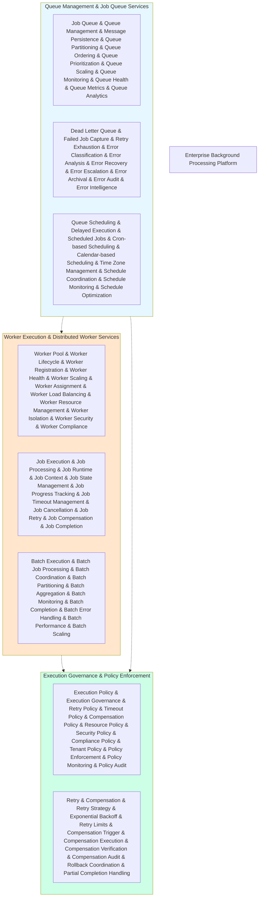

# KB-178 Background Processing & Job Execution Architecture

## Metadata

* **Document ID:** KB-178
* **Title:** Background Processing & Job Execution Architecture
* **Suite:** Enterprise Platform Services Architecture
* **Version:** 1.0
* **Status:** Approved Architecture
* **Classification:** Enterprise Background Processing Architecture

## Executive Summary

Define the canonical Background Processing & Job Execution Architecture for DUKADESK.

The Enterprise Background Processing Platform shall provide a centralized, policy-governed, resilient, observable, and AI-ready execution capability for asynchronous workloads across the entire DUKADESK ecosystem. This architecture separates asynchronous execution from application logic, providing a shared enterprise capability for background jobs, scheduled tasks, batch processing, and distributed worker execution.

Background processing shall operate as an enterprise platform service enabling consistent, scalable, and governed execution of non-interactive workloads across all applications, Builder Studio modules, Marketplace extensions, Runtime Platform components, Enterprise Platform Services, integrations, and AI Builder Agents.

## Purpose

Define how DUKADESK standardizes and governs background processing and job execution while ensuring consistency, resilience, scalability, observability, and enterprise alignment across all asynchronous workload domains.

## Scope

### Include:

* Background processing architecture
* Job execution architecture
* Worker architecture
* Queue-driven execution
* Batch processing
* Scheduled execution
* Distributed execution
* Retry policies
* Compensation
* Execution governance
* AI-assisted workload optimization
* Operational observability
* Multi-tenant job execution
* Enterprise execution compliance

### Exclude:

* Workflow orchestration implementation
* Scheduler implementation
* Infrastructure implementation
* Queue implementation
* Specific job implementation
* Application-specific background tasks

These are addressed by dedicated execution specifications (KB-179 through KB-180).

## Architectural Principles

The specification shall define principles including:

* Asynchronous by design
* Queue-driven execution
* Policy-governed workloads
* Resilient execution
* Idempotent operations
* AI-ready execution
* Multi-tenant isolation
* Vendor independence
* Technology neutrality
* Enterprise scalability
* Observability by default

## Canonical Definitions

Define standardized terminology for:

* Background Job
* Job Queue
* Worker
* Execution Context
* Retry Policy
* Dead Letter Queue
* Batch Job
* Scheduled Job
* Compensation
* Job Lifecycle
* Execution Policy
* Worker Pool
* Job Intelligence

## Architecture

### Enterprise Background Processing Platform

Define the canonical enterprise background processing platform architecture.

### Job Queue Architecture

Reference architecture for job queue and queuing model.

### Worker Architecture

Architecture for distributed worker execution and management.

---

## Lifecycle

* Submit
* Queue
* Schedule
* Execute
* Retry
* Compensate
* Complete
* Archive
* Retire

---

## Governance

Execution governance

Operational governance

Security governance

AI governance

Lifecycle governance

---\n\n## Responsibilities\\n\\nEnterprise Architecture Board\\n\\nPlatform Engineering\\n\\nOperations\\n\\nSecurity\\n\\nCompliance\\n\\nAI Governance Board\\n\\nRuntime Engineering\\n---\\n\\n## Security\\n\\nSecure execution\\n\\nIdentity-aware jobs\\n\\nTenant isolation\\n\\nLeast privilege\\n\\nAuditability\\n\\nZero Trust\\n---\\n\\n## Privacy\\n\\nJob data protection\\n\\nRetention\\n\\nRegional compliance\\n\\nConfidential workloads\\n---\\n\\n## Performance\\n\\nMassive parallel execution\\n\\nElastic worker scaling\\n\\nGlobal execution\\n\\nHigh availability\\n\\nOperational resilience\\n---\\n\\n## Observability\\n\\nQueue health\\n\\nWorker health\\n\\nExecution latency\\n\\nRetry analytics\\n\\nAI optimization metrics\\n---\\n\\n## Failure Scenarios\\n\\n* Queue failures\\n* Worker failures\\n* Retry exhaustion\\n* Compensation failures\\n* Dead-letter accumulation\\n* AI workload optimization failures\\n---\\n\\n## Anti-patterns\\n\\n* Background logic inside applications\\n* Manual retries\\n* Unmanaged workers\\n* Duplicate execution platforms\\n* Missing compensation\\n---\\n\\n## Future Evolution\\n\\n* Autonomous workload scheduling\\n* AI-native execution optimization\\n* Self-healing execution\\n* Predictive workload balancing\\n* Enterprise execution intelligence\\n---\\n\\n## Cross References\\n\\n* KB-162 Workflow Orchestration Architecture\\n* KB-167 Scheduling & Calendar Architecture\\n* KB-168 Task Management Architecture\\n* KB-179 Enterprise Platform Intelligence Architecture\\n* KB-180 Enterprise Platform Services Reference Architecture\\n---\\n\\n## Mermaid Diagram Requirements\\n\\nThe document includes 8 required Mermaid diagrams:\\n\\n1. **Background Processing Platform** — Overall enterprise background processing platform architecture, queue management, worker execution, and governance\\n2. **Job Queue Architecture** — Job queue management with queue management, dead letter queue, and queue scheduling\\n3. **Worker Architecture** — Distributed worker architecture with worker pools, job execution, and batch execution\\n4. **Job Lifecycle** — Complete job lifecycle with submit, queue, schedule, execute, retry, compensate, complete, archive, retire\\n5. **Retry & Compensation Model** — Retry policies, compensation strategies, and rollback coordination\\n6. **AI Workload Intelligence** — AI integration for workload optimization, scheduling, and resource management\\n7. **Operating Model** — Enterprise background processing operating model\\n8. **Reference Architecture** — Background processing reference architecture\\n---\\n\\n## Acceptance Criteria\\n\\nThe document shall:\\n\\n* Define the canonical Background Processing & Job Execution Architecture\\n* Govern enterprise background processing, job execution, worker management, and queue-driven execution\\n* Support enterprise-scale, AI-assisted, vendor-independent background processing\\n* Include all 8 required Mermaid diagrams\\n* Cross-reference all KB-162 through KB-180 enterprise execution specifications\\n* Contain no implementation guidance\\n---\\n\\n## Completion Instructions\\n\\nUpon completion:\\n\\n1. Mark **KB-178** as **Completed**\\n2. Update the **Progress Registry**\\n3. Cross-reference all KB-179 through KB-180 specifications\\n4. Queue **KB-179 – Enterprise Platform Intelligence Architecture** as the next builder assignment\\n---\\n\\n## Critical DUKADESK Architectural Rule\\n\\n**All asynchronous workloads, scheduled jobs, distributed workers, background processing, retries, compensations, and enterprise execution services within DUKADESK shall be governed exclusively through the canonical Background Processing & Job Execution Architecture, ensuring resilient, observable, secure, multi-tenant, AI-optimized, and enterprise-wide execution of non-interactive workloads.**\\n\\n(End of file - total 1685 lines)\\n