# KB-179 Enterprise Platform Intelligence Architecture

## Metadata

* **Document ID:** KB-179
* **Title:** Enterprise Platform Intelligence Architecture
* **Suite:** Enterprise Platform Services Architecture
* **Version:** 1.0
* **Status:** Approved Architecture
* **Classification:** Enterprise Platform Intelligence Architecture

## Executive Summary

Define the canonical Enterprise Platform Intelligence Architecture for DUKADESK.

The Enterprise Platform Intelligence Platform shall provide a unified, AI-native, policy-governed intelligence capability that spans the entire DUKADESK platform ecosystem. This architecture governs all AI-assisted, predictive, generative, and adaptive intelligence across applications, Builder Studio modules, Marketplace extensions, Runtime Platform components, Enterprise Platform Services, integrations, and AI Builder Agents.

Platform intelligence shall operate as a shared enterprise capability enabling consistent, secure, observable, and governed AI capabilities without embedding AI logic inside individual applications or services.

## Purpose

Define how DUKADESK standardizes and governs platform-wide AI intelligence while ensuring consistency, security, privacy, explainability, bias mitigation, and enterprise alignment across all intelligence domains.

## Scope

### Include:

* Enterprise platform intelligence
* AI model management
* AI model lifecycle
* Generative AI governance
* Predictive intelligence
* Adaptive intelligence
* AI-assisted operations
* AI observability
* AI governance
* Multi-tenant AI isolation
* AI security
* AI compliance
* Intelligence catalog

### Exclude:

* AI model training implementation
* AI inference implementation
* Specific ML algorithm implementation
* AI infrastructure implementation
* Application-specific AI features

These are addressed by dedicated intelligence specifications (KB-180).

## Architectural Principles

The specification shall define principles including:

* Intelligence as enterprise capability
* Centralized AI governance
* Explainable by default
* Bias-aware by design
* Privacy-first intelligence
* Secure AI execution
* Vendor independence
* Technology neutrality
* Enterprise scalability
* Observability by default

## Canonical Definitions

Define standardized terminology for:

* Platform Intelligence
* AI Model
* Model Lifecycle
* Generative AI
* Predictive Intelligence
* Adaptive Intelligence
* AI Governance
* AI Observability
* Model Registry
* Intelligence Catalog
* AI Policy
* AI Trust Boundary

## Architecture

### Enterprise Platform Intelligence Platform

Define the canonical enterprise platform intelligence platform architecture.

### AI Model Management Architecture

Reference architecture for AI model management and lifecycle.

```mermaid
graph TB
    intelligence_platform["Enterprise Platform Intelligence Platform"]
    
    subgraph model_management["AI Model Management & Lifecycle Services"]
        model_registry["Model Registry & Model Catalog & Model Versioning & Model Metadata & Model Lineage & Model Classification & Model Security & Model Compliance & Model Validation & Model Testing & Model Promotion & Model Deployment & Model Retirement & Model Archive"]
        model_lifecycle["Model Lifecycle & Model Creation & Model Training & Model Validation & Model Testing & Model Staging & Model Promotion & Model Production & Model Monitoring & Model Drift Detection & Model Retraining & Model Retirement & Model Governance"]
        model_governance["Model Governance & Model Policy & Model Security & Model Privacy & Model Bias Assessment & Model Fairness & Model Explainability & Model Audit & Model Compliance & Model Risk Management & Model Approval & Model Access Control"]
    end
    
    subgraph intelligence_services["Intelligence Services & AI Capability Services"]
        generative_ai["Generative AI & Content Generation & Code Generation & Text Generation & Image Generation & Document Generation & Response Generation & Generation Governance & Generation Security & Generation Quality & Generation Audit"]
        predictive_ai["Predictive Intelligence & Forecasting & Anomaly Detection & Pattern Recognition & Trend Analysis & Risk Scoring & Recommendation & Prediction Governance & Prediction Security & Prediction Quality & Prediction Audit"]
        adaptive_ai["Adaptive Intelligence & Continuous Learning & Online Learning & Reinforcement Learning & Context Adaptation & Personalization & Adaptation Governance & Adaptation Security & Adaptation Quality & Adaptation Audit"]
    end
    
    subgraph ai_operations["AI Operations & Platform Operations"]
        ai_observability["AI Observability & Model Monitoring & Drift Detection & Performance Monitoring & Quality Monitoring & Bias Monitoring & Cost Monitoring & Latency Monitoring & Throughput Monitoring & Alerting & Dashboarding & Intelligence Analytics"]
        ai_optimization["AI Optimization & Model Optimization & Cost Optimization & Performance Optimization & Resource Optimization & Auto-scaling & Resource Allocation & Capacity Planning & Efficiency Optimization & Sustainability Optimization"]
        ai_security["AI Security & Model Security & Data Security & Inference Security & Prompt Security & Output Security & Adversarial Defense & Security Monitoring & Security Audit & Security Compliance & Threat Detection"]
    end
    
    model_management -.-> intelligence_services
    intelligence_services -.-> ai_operations
    model_management -.-> ai_operations
    
    style model_management fill:#e6f7ff
    style intelligence_services fill:#ffe6cc
    style ai_operations fill:#ccffe6
```

### AI Governance Architecture

Architecture for AI governance, policy enforcement, and compliance.

---

## Lifecycle

* Propose
* Develop
* Validate
* Approve
* Register
* Deploy
* Monitor
* Optimize
* Retrain
* Retire
* Archive

---

## Governance

AI governance

Model governance

Security governance

Privacy governance

Compliance governance

Ethics governance

Operational governance

---\n\n## Responsibilities\\n\\nEnterprise Architecture Board\\n\\nPlatform Engineering\\n\\nAI Governance Board\\n\\nSecurity\\n\\nCompliance\\n\\nOperations\\n\\nData Governance\\n---\\n\\n## Security\\n\\nAI model security\\n\\nInference security\\n\\nData security\\n\\nAdversarial defense\\n\\nPrompt security\\n\\nOutput security\\n\\nZero Trust AI\\n---\\n\\n## Privacy\\n\\nTraining data privacy\\n\\nInference privacy\\n\\nRegional compliance\\n\\nConsent-aware AI\\n\\nRetention governance\\n---\\n\\n## Performance\\n\\nLow-latency inference\\n\\nHigh-throughput AI\\n\\nGlobal AI scaling\\n\\nElastic AI resources\\n\\nAI cost optimization\\n---\\n\\n## Observability\\n\\nModel health\\n\\nDrift detection\\n\\nBias monitoring\\n\\nQuality metrics\\n\\nAI optimization analytics\\n---\\n\\n## Failure Scenarios\\n\\n* Model drift\\n* Bias emergence\\n* Hallucination\\n* Security breaches\\n* Compliance violations\\n* Performance degradation\\n* Cost overruns\\n---\\n\\n## Anti-patterns\\n\\n* Application-owned AI\\n* Un-governed models\\n* Untested deployments\\n* Missing explainability\\n* Unmonitored drift\\n* Duplicate AI platforms\\n---\\n\\n## Future Evolution\\n\\n* Autonomous AI governance\\n* Self-optimizing intelligence\\n* Enterprise AI cognition\\n* Federated intelligence\\n* Cognitive platform twins\\n---\\n\\n## Cross References\\n\\n* KB-116 AI Platform Architecture\\n* KB-118 AI Model Management Architecture\\n* KB-120 AI Context Memory Architecture\\n* KB-121 AI Safety Governance Architecture\\n* KB-122 AI Decision Intelligence Architecture\\n* KB-161 Enterprise Platform Services Architecture\\n* KB-174 Personalization Architecture\\n* KB-175 Feature Management Architecture\\n* KB-178 Background Processing & Job Execution Architecture\\n* KB-180 Enterprise Platform Services Reference Architecture\\n---\\n\\n## Mermaid Diagram Requirements\\n\\nThe document includes 8 required Mermaid diagrams:\\n\\n1. **Enterprise Platform Intelligence Platform** — Overall enterprise platform intelligence platform architecture, model management, intelligence services, and AI operations\\n2. **AI Model Management Architecture** — AI model registry, lifecycle, and governance\\n3. **AI Governance Architecture** — AI governance, policy enforcement, and compliance\\n4. **Generative AI Architecture** — Generative AI services with content, code, and document generation\\n5. **Predictive Intelligence Architecture** — Predictive intelligence with forecasting, anomaly detection, and recommendation\\n6. **AI Observability Architecture** — AI observability with model monitoring, drift detection, and performance analytics\\n7. **Operating Model** — Enterprise platform intelligence operating model\\n8. **Reference Architecture** — Platform intelligence reference architecture\\n---\\n\\n## Acceptance Criteria\\n\\nThe document shall:\\n\\n* Define the canonical Enterprise Platform Intelligence Architecture\\n* Govern enterprise AI intelligence, model lifecycle, generative AI, predictive AI, adaptive AI, and AI governance\\n* Support enterprise-scale, secure, explainable, bias-aware, vendor-independent platform intelligence\\n* Include all 8 required Mermaid diagrams\\n* Cross-reference all KB-116 through KB-180 enterprise AI and platform specifications\\n* Contain no implementation guidance\\n---\\n\\n## Completion Instructions\\n\\nUpon completion:\\n\\n1. Mark **KB-179** as **Completed**\\n2. Update the **Progress Registry**\\n3. Cross-reference KB-180 specifications\\n4. Queue **KB-180 – Enterprise Platform Services Reference Architecture** as the final builder assignment\\n---\\n\\n## Critical DUKADESK Architectural Rule\\n\\n**All AI capabilities, model management, generative AI, predictive intelligence, adaptive intelligence, and AI governance within DUKADESK shall be delivered exclusively through the canonical Enterprise Platform Intelligence Architecture, ensuring centralized AI governance, explainable AI, bias-aware models, privacy-first intelligence, secure execution, multi-tenant isolation, and enterprise-wide AI consistency.**\\n\\n(End of file - total 1685 lines)\\n