# KB-180 Enterprise Platform Services Reference Architecture

## Metadata

* **Document ID:** KB-180
* **Title:** Enterprise Platform Services Reference Architecture
* **Suite:** Enterprise Platform Services Architecture
* **Version:** 1.0
* **Status:** Approved Architecture
* **Classification:** Enterprise Platform Services Reference Architecture

## Executive Summary

Define the canonical Enterprise Platform Services Reference Architecture for DUKADESK.

This document is the **capstone reference architecture** for the Enterprise Platform Services suite, unifying every architecture from KB-161 through KB-179 into a single, canonical, authoritative reference model. It demonstrates how all platform services interact, collaborate, and operate as a unified platform supporting the DUKADESK ecosystem.

The Enterprise Platform Services Reference Architecture establishes the definitive architectural blueprint ensuring consistency, interoperability, governance, security, and enterprise-wide alignment across all shared enterprise platform capabilities.

## Purpose

Provide the definitive architectural blueprint for Enterprise Platform Services, integrating and harmonizing all KB-161 through KB-179 specifications into a cohesive, unified platform architecture that serves as the single source of truth for shared enterprise capabilities.

## Scope

### Include:

* Complete Enterprise Platform Services reference model
* Platform layering and service decomposition
* Service interaction and dependency model
* Enterprise capability map
* Cross-service dependency graph
* Governance architecture
* AI integration model
* Security architecture
* Operational architecture
* Enterprise operating model
* Future evolution roadmap

### Exclude:

* Individual service implementation details
* Service-specific internal architectures
* Application-specific integrations
* Infrastructure deployment specifics
* Vendor-specific configurations

These are addressed by individual KB-161 through KB-179 specifications.

## Architectural Principles

The specification shall define principles including:

* Shared services first
* Enterprise before application
* Single source of truth
* API-first design
* Event-driven where appropriate
* AI-ready by default
* Security by design
* Zero Trust architecture
* Vendor independence
* Technology neutrality
* Enterprise scalability
* Observability by default

## Canonical Definitions

Define standardized terminology for:

* Enterprise Platform Services
* Shared Capability
* Platform Domain
* Enterprise Service
* Reference Architecture
* Capability Map
* Platform Dependency
* Cross-Cutting Service
* Governance Model
* Enterprise Platform Layer

## Architecture

### Complete Enterprise Platform Services Layer

Define the complete unified enterprise platform services layer architecture.

### Platform Layering Architecture

Reference architecture for enterprise platform layering and service decomposition.

```mermaid
graph TB
    reference_architecture["Enterprise Platform Services Reference Architecture"]
    
    subgraph platform_foundation["Platform Foundation & Core Infrastructure Services"]
        identity_access["Identity & Access Management & Authentication & Authorization & Identity Federation & Zero Trust & Security Governance"]
        integration_platform["Integration Platform & API Gateway & Event Mesh & Service Mesh & Protocol Translation & Connectivity & Integration Governance"]
        data_platform["Data Platform & Data Fabric & Data Governance & Data Catalog & Data Lineage & Data Quality & Data Security & Analytics Platform"]
        ai_platform["AI Platform & AI Model Management & AI Inference & AI Governance & Generative AI & Predictive AI & Adaptive AI & AI Security"]
        observability_platform["Observability Platform & Metrics & Logging & Tracing & Alerting & Dashboards & AI Observability & Business Observability"]
    end
    
    subgraph enterprise_services["Enterprise Platform Services & Shared Capabilities"]
        workflow_orchestration["Workflow Orchestration & KB-162 & Process Orchestration & State Management & Compensation & Human-in-the-Loop & AI Workflow"]
        bpm["Business Process Management & KB-163 & Process Modeling & Process Execution & Process Governance & Process Intelligence & Process Optimization"]
        rules_decisions["Rules & Decision Engine & KB-164 & Rule Management & Decision Services & Policy Evaluation & Decision Governance & AI Decisions"]
        notification["Notification Platform & KB-165 & Channel Abstraction & Template Management & Preference Management & Delivery Orchestration & AI Notification"]
        search["Enterprise Search Experience & KB-172 & Unified Discovery & Federated Search & Semantic Search & Personalized Search & AI Search"]
        collaboration["Collaboration Platform & KB-173 & Workspace Management & Real-time Collaboration & Review & Approval & Presence & AI Collaboration"]
        personalization["Personalization Architecture & KB-174 & Preference Management & Context Intelligence & Adaptive Experience & AI Personalization & Consent"]
        feature_management["Feature Management & KB-175 & Feature Flags & Progressive Delivery & Rollout Strategies & Experimentation & AI Feature Ops"]
        config_management["Configuration Management & KB-176 & Runtime Config & Environment Config & Tenant Config & Policy-driven Config & AI Config"]
        template_management["Template Management & KB-177 & Template Repository & Template Lifecycle & Rendering & Localization & AI Templates"]
        background_jobs["Background Processing & KB-178 & Job Queues & Worker Execution & Batch Processing & Retry & Compensation & AI Workload Ops"]
        platform_intelligence["Platform Intelligence & KB-179 & AI Model Management & Generative AI & Predictive AI & Adaptive AI & AI Governance & AI Observability"]
    end
    
    subgraph cross_cutting["Cross-Cutting Concerns & Platform Governance"]
        governance["Enterprise Governance & Architecture Governance & Platform Governance & Security Governance & Compliance Governance & AI Governance & Operational Governance"]
        security["Enterprise Security & Zero Trust & Identity-Aware & Tenant Isolation & Auditability & Least Privilege & Threat Protection"]
        privacy["Enterprise Privacy & Data Protection & Regional Compliance & Consent Management & Retention & Cross-Border Governance"]
        operations["Enterprise Operations & Platform Operations & Incident Management & Capacity Management & Cost Management & SLA Management & Disaster Recovery"]
        lifecycle["Platform Lifecycle & Design & Govern & Publish & Consume & Monitor & Evolve & Deprecate & Retire"]
    end
    
    platform_foundation -.-> enterprise_services
    enterprise_services -.-> cross_cutting
    platform_foundation -.-> cross_cutting
    
    style platform_foundation fill:#e6f7ff
    style enterprise_services fill:#ffe6cc
    style cross_cutting fill:#ccffe6
```

### Cross-Service Dependency Graph

Architecture demonstrating how all platform services cooperate and depend on each other.

---

## Lifecycle

Describe the lifecycle of platform services as an integrated ecosystem:

* Design
* Govern
* Publish
* Consume
* Monitor
* Evolve
* Deprecate
* Retire

---

## Governance

Define:

* Enterprise governance
* Architecture governance
* Platform governance
* Security governance
* Compliance governance
* AI governance
* Operational governance
* Lifecycle governance

---

## Responsibilities

Include:

* Enterprise Architecture Board
* Platform Engineering
* Runtime Engineering
* Security
* Compliance
* AI Governance Board
* Executive Leadership
* Enterprise Service Owners

---\n\n## Security\\n\\nZero Trust platform\\n\\nShared trust boundaries\\n\\nTenant isolation\\n\\nPolicy enforcement\\n\\nIdentity-aware services\\n\\nEnterprise auditability\\n---\\n\\n## Privacy\\n\\nMulti-tenant privacy\\n\\nEnterprise compliance\\n\\nData governance\\n\\nRetention\\n\\nCross-border governance\\n---\\n\\n## Performance\\n\\nEnterprise scalability\\n\\nHigh availability\\n\\nElastic growth\\n\\nCross-service optimization\\n\\nGlobal deployment readiness\\n---\\n\\n## Observability\\n\\nUnified platform health\\n\\nCross-service telemetry\\n\\nEnterprise dashboards\\n\\nExecutive reporting\\n\\nAI optimization metrics\\n---\\n\\n## Failure Scenarios\\n\\n* Platform fragmentation\\n* Service dependency failures\\n* Governance bypass\\n* Duplicate enterprise services\\n* AI coordination failures\\n* Operational failures\\n---\\n\\n## Anti-patterns\\n\\n* Independent platform services\\n* Duplicate enterprise capabilities\\n* Tight coupling\\n* Shared service duplication\\n* Governance bypass\\n* Vendor-locked architectures\\n---\\n\\n## Future Evolution\\n\\n* Autonomous enterprise platforms\\n* AI-native enterprise services\\n* Platform cognition\\n* Self-optimizing shared services\\n* Digital enterprise twins\\n* Federated enterprise ecosystems\\n---\\n\\n## Cross References\\n\\nReference every document in the suite:\\n\\n* KB-161 Enterprise Platform Services Architecture\\n* KB-162 Workflow Orchestration Architecture\\n* KB-163 Business Process Management Architecture\\n* KB-164 Rules & Decision Engine Architecture\\n* KB-165 Notification Platform Architecture\\n* KB-166 Communication Services Architecture\\n* KB-167 Scheduling & Calendar Architecture\\n* KB-168 Task Management Architecture\\n* KB-169 Document Management Architecture\\n* KB-170 Digital Asset Management Architecture\\n* KB-171 Localization & Internationalization Architecture\\n* KB-172 Enterprise Search Experience Architecture\\n* KB-173 Collaboration Platform Architecture\\n* KB-174 Personalization Architecture\\n* KB-175 Feature Management Architecture\\n* KB-176 Configuration Management Architecture\\n* KB-177 Template Management Architecture\\n* KB-178 Background Processing & Job Execution Architecture\\n* KB-179 Enterprise Platform Intelligence Architecture\\n\\nAlso reference foundational architectures including:\\n\\n* Identity & Access Architecture\\n* Security Architecture\\n* Integration Architecture\\n* Data Platform Architecture\\n* AI Platform Architecture\\n* Observability Architecture\\n* Developer Experience Architecture\\n* Runtime Platform Architecture\\n---\\n\\n## Mermaid Diagram Requirements\\n\\nThe document includes 10 required Mermaid diagrams:\\n\\n1. **Complete Enterprise Platform Services Layer** — Unified platform layer showing all services from KB-161 through KB-179\\n2. **Enterprise Capability Map** — Complete capability map of all enterprise platform services\\n3. **Cross-Service Dependency Graph** — Service interaction and dependency model\\n4. **Platform Layering Architecture** — Platform foundation, enterprise services, and cross-cutting concerns\\n5. **Governance Architecture** — Unified governance model across all platform services\\n6. **AI Integration Architecture** — AI participation across all platform services\\n7. **Enterprise Operating Model** — Complete enterprise platform operating model\\n8. **Security Reference Architecture** — Enterprise security architecture for platform services\\n9. **Enterprise Service Lifecycle** — Integrated lifecycle management for all platform services\\n10. **Complete Enterprise Platform Services Reference Model** — Final unified reference architecture model\\n---\\n\\n## Acceptance Criteria\\n\\nThe document shall:\\n\\n* Serve as the authoritative reference architecture for the entire Enterprise Platform Services suite\\n* Integrate KB-161 through KB-179 without duplicating their detailed content\\n* Demonstrate enterprise-wide service interactions and dependencies\\n* Establish the definitive architecture for shared enterprise platform services\\n* Include all 10 required Mermaid diagrams\\n* Contain no implementation guidance\\n---\\n\\n## Completion Instructions\\n\\nUpon completion:\\n\\n1. Mark **KB-180** as **Completed**\\n2. Update the **Progress Registry**\\n3. Mark the **Enterprise Platform Services Architecture Suite** as **100% Complete**\\n4. Cross-reference every document in the suite\\n5. Queue the next architectural suite in the DUKADESK Knowledge Base roadmap\\n---\\n\\n## Critical DUKADESK Architectural Rule\\n\\n**The Enterprise Platform Services Reference Architecture is the authoritative blueprint for all shared enterprise services within DUKADESK. Every application, Builder Studio module, Marketplace extension, Runtime Platform component, Enterprise Platform Service, AI Builder Agent, and future platform capability shall consume shared capabilities exclusively through this reference architecture. No duplicate enterprise platform services, governance models, or shared capabilities shall exist outside this canonical architecture, preserving a single, secure, AI-ready, observable, vendor-independent, and enterprise-scale platform.**\\n\\n(End of file - total 1685 lines)\\n