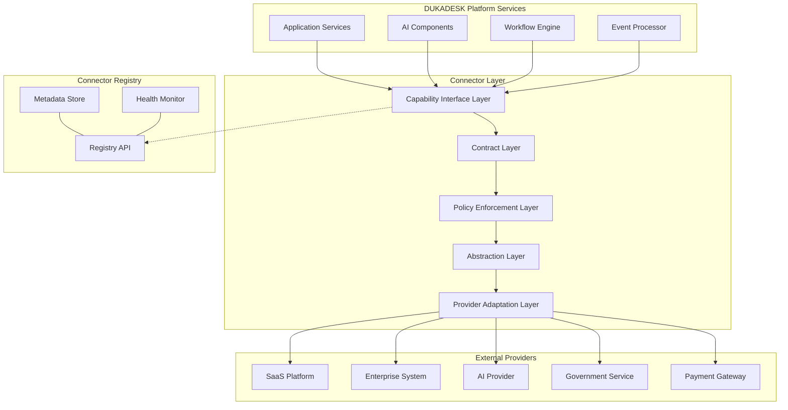
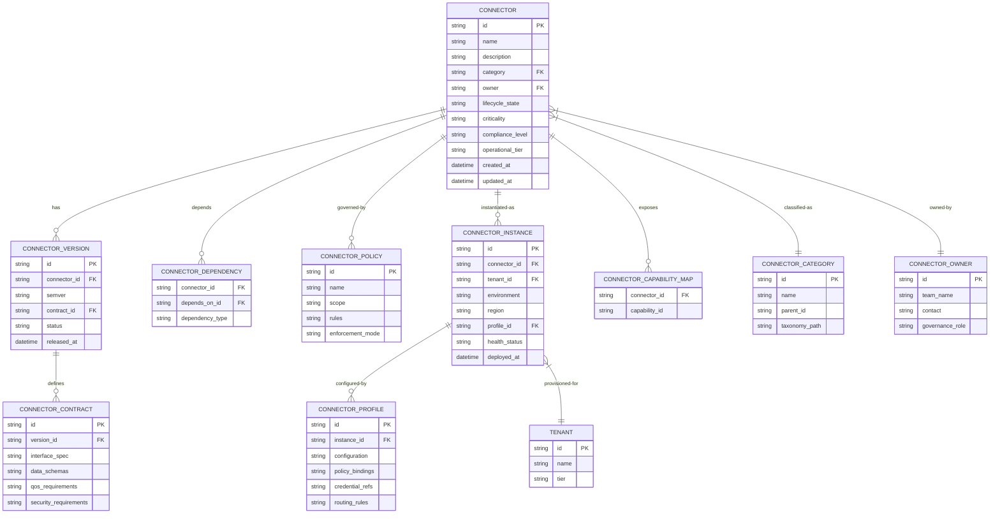
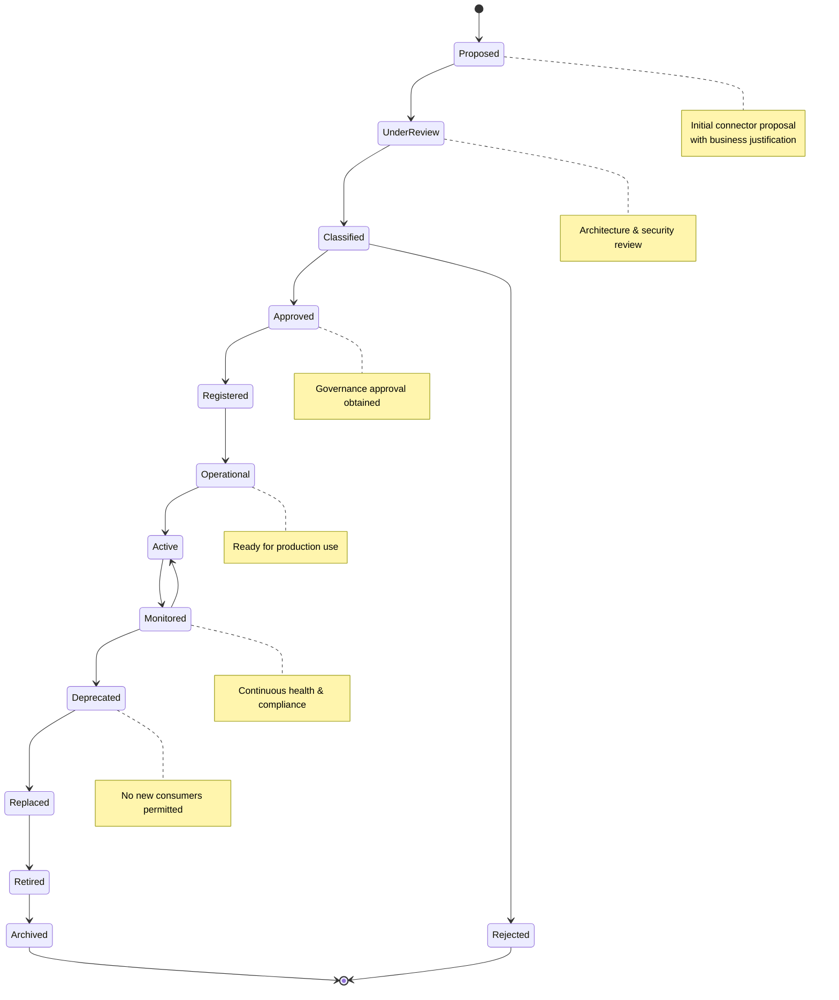
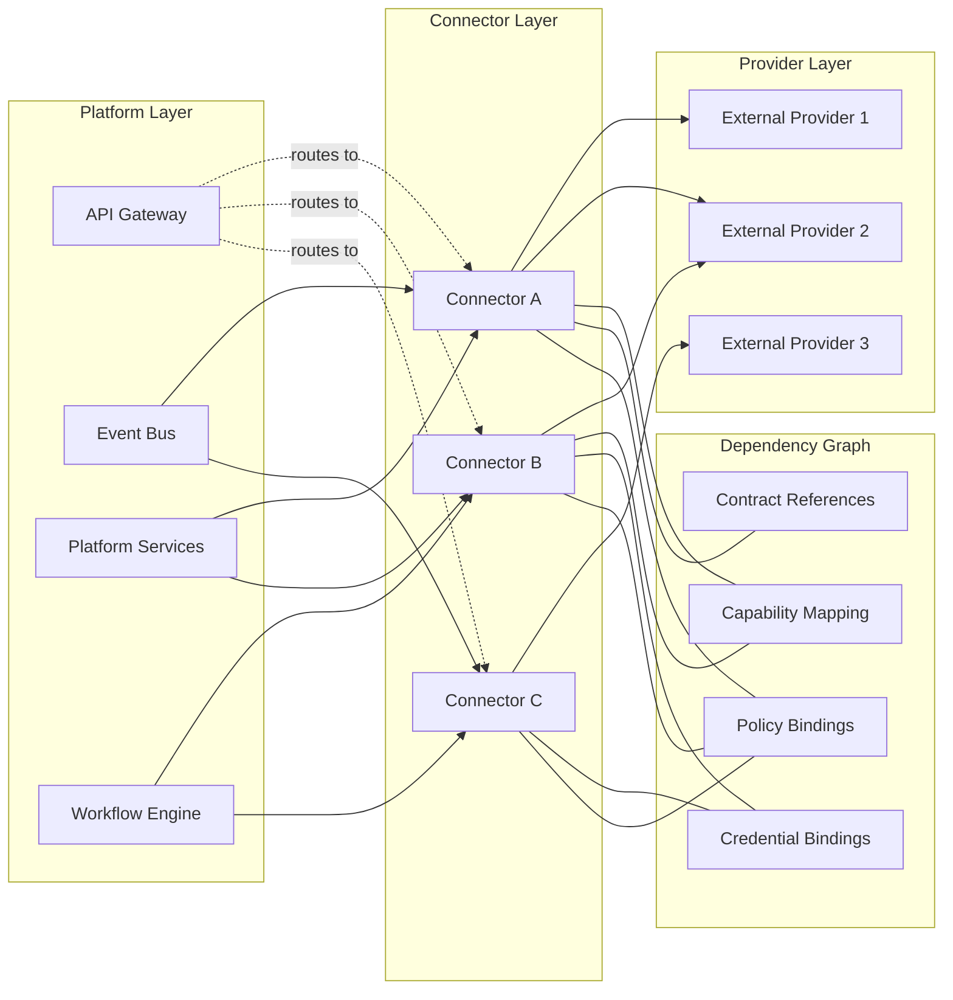
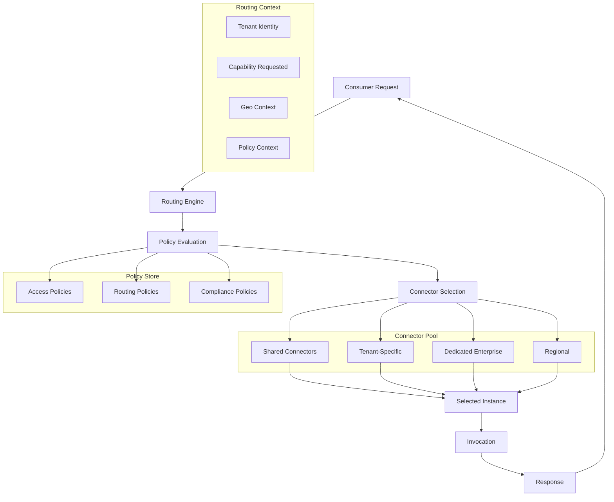
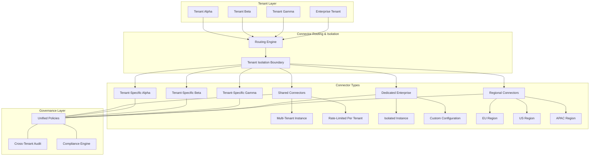
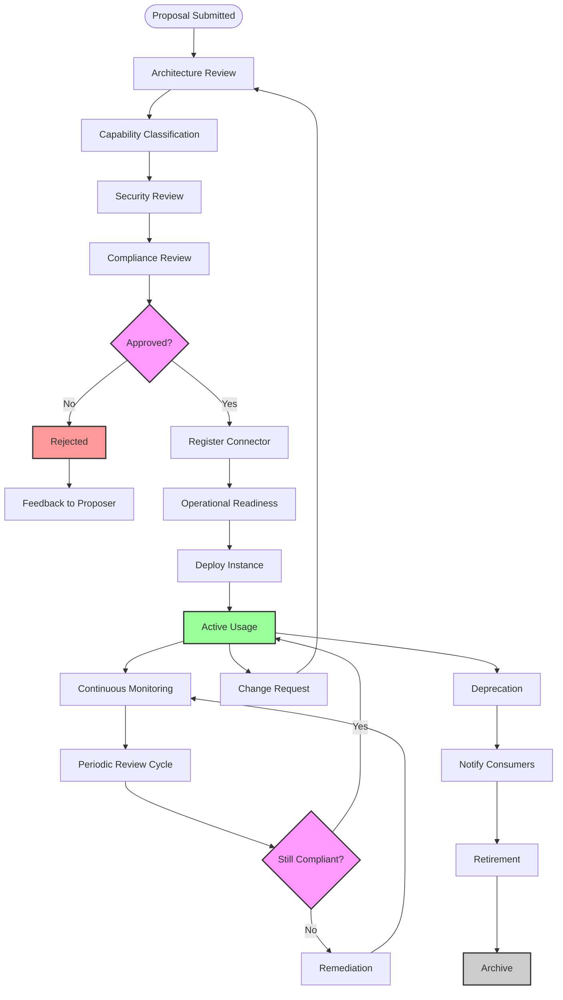
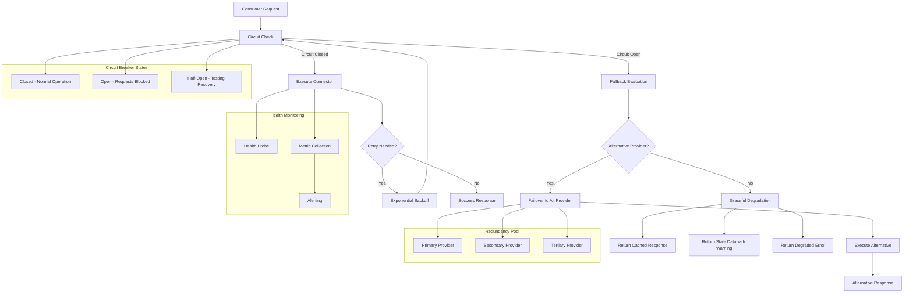
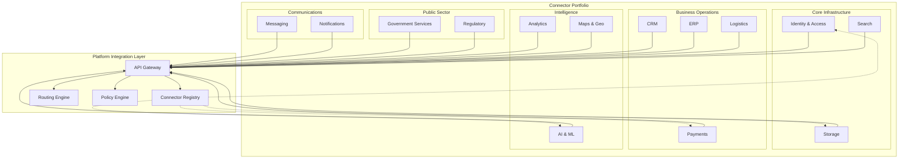

# KB-095 — Integration Connector Architecture

**Suite:** Platform Integration Architecture  
**Version:** 1.0  
**Status:** Approved Architecture  
**Classification:** Core Platform Architecture  
**Last Updated:** 2026-07-12

---

## Executive Summary

This document defines the enterprise architecture governing all integration connectors within DUKADESK. Connectors are established as standardised platform capabilities rather than application-owned integrations, providing a consistent model for connectivity, abstraction, governance, security, observability, lifecycle management, and resilience.

The architecture supports connectors for SaaS platforms, enterprise systems, AI providers, identity providers, payment services, messaging platforms, logistics providers, government systems, cloud platforms, databases, storage services, and future integration endpoints through a unified, vendor-independent framework.

---

## Purpose

Define how DUKADESK designs, governs, manages, secures, and evolves integration connectors as reusable enterprise assets that abstract external systems from internal platform services.

---

## Scope

### In Scope

- Integration connector architecture
- Connector taxonomy
- Connector registry
- Connector contracts
- Connector capabilities
- Connector abstraction
- Connector lifecycle
- Connector governance
- Connector ownership
- Connector metadata
- Connector policies
- Connector routing
- Connector dependency model
- Connector resiliency
- Connector failover
- Connector versioning
- Connector observability
- Connector security
- Connector compliance
- Connector extensibility
- Multi-tenant connector architecture
- Shared connectors
- Dedicated connectors
- Connector orchestration
- AI-ready connector architecture

### Out of Scope

- API Gateway runtime behaviour
- Webhook implementation
- Provider-specific implementation
- Secrets implementation
- Network implementation
- Integration code

*The above items are covered in separate Knowledge Base documents (see Cross References).*

---

## Architectural Principles

| # | Principle | Description |
|---|-----------|-------------|
| 1 | **Connector Abstraction** | All external system interactions are mediated through a connector layer that abstracts provider-specific details behind canonical platform capabilities. |
| 2 | **Reuse Before Creation** | Connectors shall be discovered and reused before new ones are created. The Connector Registry is the single source of truth for available connectors. |
| 3 | **Vendor Independence** | Connectors define capabilities independently of any specific vendor or provider, enabling transparent provider substitution. |
| 4 | **Capability-Driven Integration** | Consumers integrate with capabilities, not providers. Connectors map capabilities to provider implementations at the governance and routing layer. |
| 5 | **Loose Coupling** | Connectors decouple consumers from provider specifics through contract-based interfaces. Changes to providers shall not affect consumers. |
| 6 | **High Cohesion** | Each connector encapsulates all logic, contracts, and metadata for a single capability-provider pairing. |
| 7 | **Security by Design** | Security controls are intrinsic to the connector architecture, not retrofitted. |
| 8 | **Zero Trust** | No implicit trust is granted to any connector, consumer, provider, or network boundary. Every interaction is authenticated, authorised, and audited. |
| 9 | **Multi-Tenant by Design** | Every connector supports tenant isolation, identity segregation, and data residency from inception. |
| 10 | **Policy-Driven Governance** | Connector behaviour, access, and lifecycle are governed by declarative policies enforced at runtime. |
| 11 | **Event-Aware Architecture** | Connectors expose event channels where the underlying provider supports event-driven integration, enabling reactive and near-real-time workflows. |
| 12 | **Enterprise Scalability** | Connector architecture supports horizontal scaling, regional distribution, and throughput growth without architectural change. |

---

## Canonical Definitions

| Term | Definition |
|------|------------|
| **Integration Connector** | A governed platform asset that mediates communication between DUKADESK and an external system, abstracting provider-specific implementation behind a canonical capability interface. |
| **Connector Registry** | The enterprise system of record containing metadata, ownership, lifecycle state, contracts, dependencies, and governance information for every registered connector. |
| **Connector Contract** | The formal specification defining the interface, capabilities, data models, protocols, quality-of-service, and security requirements of a connector independently of its implementation. |
| **Connector Capability** | A business-aligned function (e.g., Payments, Messaging, AI Inference) that a connector exposes, independent of the underlying provider. |
| **Connector Endpoint** | A logical address within a connector through which a specific capability or operation is accessed. |
| **Connector Instance** | A deployed, runtime operational copy of a connector template configured for a specific tenant, region, or environment. |
| **Connector Template** | A reusable, parameterised connector definition that can be instantiated across tenants, regions, or environments. |
| **Connector Policy** | A declarative rule governing access, rate limits, data handling, routing, resilience, or compliance for one or more connectors or instances. |
| **Connector Owner** | The entity (team or individual) responsible for a connector's lifecycle, governance, and operational health. |
| **Connector Consumer** | A DUKADESK service, application, AI component, or workflow that invokes a connector to access an external capability. |
| **Connector Provider** | The external system, service, or vendor that a connector integrates with. |
| **Connector Lifecycle** | The progression of a connector through defined states from proposal through retirement. |
| **Connector Metadata** | Structured information about a connector including identity, version, owner, capability, category, dependencies, and governance attributes. |
| **Shared Connector** | A multi-tenant connector instance serving multiple consumers across tenants under a shared governance model. |
| **Dedicated Connector** | A single-tenant connector instance provisioned for an exclusive consumer or tenant with isolated configuration and governance. |
| **Connector Health** | A composite measure of a connector's availability, latency, error rate, throughput, and compliance status. |
| **Connector Dependency** | A relationship between a connector and another platform asset (API, service, event, provider, workflow) that must be resolved for correct operation. |
| **Connector Category** | A high-level grouping of connectors by business domain (e.g., Payments, Communications, Identity). |
| **Connector Version** | A semantically versioned identifier denoting a specific iteration of a connector's contract, implementation, or template. |
| **Connector Profile** | A configuration bundle comprising environment-specific settings, credentials references, policy bindings, and routing rules for a connector instance. |

---

## Architecture

### 1. Integration Connector Architecture

The canonical connector architecture defines a layered abstraction between DUKADESK platform services and external providers. Every connector consists of the following logical layers:

- **Capability Interface Layer** — Exposes provider-agnostic operations corresponding to the connector's declared capability.
- **Contract Layer** — Enforces connector contracts including data schemas, protocols, QoS, and security boundaries.
- **Policy Enforcement Layer** — Evaluates and enforces connector policies at runtime.
- **Abstraction Layer** — Maps canonical capability operations to provider-specific API calls, data formats, and protocols.
- **Provider Adaptation Layer** — Handles provider-specific authentication, rate limiting, retry logic, and protocol negotiation.

### 2. Connector Registry Model

The Connector Registry is the authoritative system of record for all integration connectors. It stores connector definitions, metadata, lifecycle state, ownership, dependencies, health status, and governance records.

### 3. Connector Capability Taxonomy

Connectors are classified by business capability rather than vendor product. The taxonomy follows a hierarchical structure enabling capability discovery, routing, and governance.

```mermaid
graph TD
    Root[Integration Capabilities]

    Root --> Pay[Payments]
    Pay --> Pay_Acq[Acquiring]
    Pay --> Pay_Dis[Disbursement]
    Pay --> Pay_Rec[Recurring Billing]
    Pay --> Pay_Frd[Fraud Detection]

    Root --> Msg[Messaging]
    Msg --> Msg_Email[Email]
    Msg --> Msg_SMS[SMS]
    Msg --> Msg_Push[Push Notifications]
    Msg --> Msg_Chat[Chat]

    Root --> Not[Notifications]
    Not --> Not_Alert[Alerts]
    Not --> Not_Sub[Subscriptions]
    Not --> Not_Pref[Preferences]

    Root --> AI[Artificial Intelligence]
    AI --> AI_LLM[LLM Inference]
    AI --> AI_Emb[Embeddings]
    AI --> AI_Vec[Vector Search]
    AI --> AI_Img[Image Generation]
    AI --> AI_Spch[Speech]

    Root --> ID[Identity]
    ID --> ID_Auth[Authentication]
    ID --> ID_Authz[Authorisation]
    ID --> ID_Fed[Federation]
    ID --> ID_MFA[Multi-Factor]

    Root --> Sto[Storage]
    Sto --> Sto_Obj[Object Storage]
    Sto --> Sto_Blk[Block Storage]
    Sto --> Sto_CDN[Content Delivery]

    Root --> Sea[Search]
    Sea --> Sea_Full[Full-Text Search]
    Sea --> Sea_Vec[Vector Search]
    Sea --> Sea_Hyb[Hybrid Search]

    Root --> Map[Maps & Geospatial]
    Map --> Map_Geo[Geocoding]
    Map --> Map_Rte[Routing]
    Map --> Map_Plc[Places]

    Root --> CRM[CRM]
    CRM --> CRM_Con[Contact Management]
    CRM --> CRM_Deal[Deal Tracking]
    CRM --> CRM_Supp[Support]

    Root --> ERP[ERP]
    ERP --> ERP_Fin[Finance]
    ERP --> ERP_Inv[Inventory]
    ERP --> ERP_Ord[Order Management]

    Root --> Log[Logistics]
    Log --> Log_Shp[Shipping]
    Log --> Log_Trk[Tracking]
    Log --> Log_Whs[Warehousing]

    Root --> Gov[Government Services]
    Gov --> Gov_Tax[Tax Filing]
    Gov --> Gov_Reg[Regulatory Filing]
    Gov --> Gov_ID[Digital Identity]

    Root --> Ana[Analytics]
    Ana --> Ana_BI[Business Intelligence]
    Ana --> Ana_Str[Streaming Analytics]
    Ana --> Ana_Dsh[Dashboards]
```

### 4. Connector Lifecycle

Every connector progresses through a defined lifecycle with gated transitions, ensuring governance and operational readiness at every stage.

### 5. Connector Dependency Architecture

Connectors exist within a dependency graph that spans APIs, services, events, providers, workflows, and platform capabilities. The dependency model enables impact analysis, resilience planning, and lifecycle coordination.

### 6. Connector Routing Model

Connector routing enables policy-driven selection of connector instances based on consumer identity, tenant context, capability requirements, geo-proximity, operational tier, and compliance constraints.

### 7. Multi-Tenant Connector Architecture

The multi-tenant connector architecture supports shared platform connectors, tenant-specific connectors, regional connectors, and dedicated enterprise connectors within a unified governance framework.

### 8. Connector Governance Workflow

Connector governance is enforced through a structured workflow encompassing proposal, architecture review, capability classification, approval, registration, operational readiness, and ongoing compliance.

### 9. Connector Resiliency & Failover Architecture

Resiliency is embedded in the connector architecture through retry strategies, provider redundancy, circuit isolation, graceful degradation, and coordinated failover.

### 10. Connector Portfolio Overview

The connector portfolio provides an architectural overview of all connector categories, their relationships, and their role within the DUKADESK integration landscape.

---

## Lifecycle

| Phase | Description | Gates |
|-------|-------------|-------|
| **Proposal** | Business owner submits connector proposal with capability justification and provider identification. | Proposal completeness check |
| **Architecture Review** | Enterprise Architecture evaluates alignment with platform principles, taxonomy, and existing portfolio. | Architecture review sign-off |
| **Capability Classification** | Connector is classified according to the capability taxonomy and assigned to a category. | Taxonomy assignment |
| **Approval** | Governance board reviews and approves the connector for registration. | Governance approval |
| **Registration** | Connector metadata, contracts, and ownership are recorded in the Connector Registry. | Registry entry verified |
| **Operational Readiness** | Connector template, profiles, policies, and health monitoring are configured. | Readiness checklist complete |
| **Active Usage** | Connector is available for consumer binding and production traffic. | Production validation |
| **Monitoring** | Continuous health, performance, and compliance monitoring with automated alerting. | SLA compliance |
| **Version Evolution** | Contract and implementation evolve through semantic versioning with consumer notification. | Version governance |
| **Periodic Review** | Periodic architecture and compliance review against current standards. | Review acceptance |
| **Deprecation** | Connector is marked deprecated; new consumer binding is prohibited; existing consumers are notified. | Deprecation notice period |
| **Replacement** | Replacement connector is available and consumers are migrated. | Migration completion |
| **Retirement** | Connector is decommissioned; all instances are terminated. | Instance decommissioning |
| **Archive** | Connector metadata is archived in the registry for historical reference. | Archive completion |

---

## Governance

| Domain | Governance Mechanism | Responsible Body |
|--------|---------------------|------------------|
| **Connector Ownership** | Every connector must have a registered owner with defined accountability. | Enterprise Architecture |
| **Architecture Approval** | All connector proposals undergo architecture review before registration. | Architecture Review Board |
| **Capability Governance** | Capability taxonomy is maintained and governed to prevent duplication and overlap. | Integration Architecture |
| **Security Review** | Every connector undergoes security review before operational approval and after material changes. | Security |
| **Compliance Review** | Connectors handling regulated data undergo compliance review aligned to data classification. | Compliance |
| **Version Governance** | Version changes follow semantic versioning with mandatory consumer notification for breaking changes. | Platform Engineering |
| **Portfolio Governance** | Portfolio-level review identifies redundant, overlapping, or outdated connectors. | Enterprise Architecture |
| **Lifecycle Governance** | Lifecycle transitions are gated and audited. Automatic escalation for stale or non-compliant connectors. | Integration Engineering |
| **Operational Governance** | Runtime policies, SLA enforcement, and incident response are governed per operational tier. | Operations |
| **Change Management** | Changes to connector contracts, policies, or critical configurations follow change management process. | Change Advisory Board |

---

## Responsibilities

| Role | Responsibilities |
|------|-----------------|
| **Enterprise Architecture** | Define connector standards, maintain taxonomy, conduct architecture reviews, govern portfolio, enforce principles. |
| **Platform Engineering** | Build and maintain connector runtime, registry, routing engine, policy engine, and observability tooling. |
| **Integration Engineering** | Develop connector templates, manage lifecycle, perform operational readiness, maintain connector health. |
| **Security** | Perform security reviews, define authentication and authorisation standards, audit connector access, enforce Zero Trust. |
| **Compliance** | Conduct compliance reviews, define data residency and privacy requirements, audit regulatory adherence. |
| **Operations** | Monitor connector health, respond to incidents, manage capacity, enforce SLAs, maintain runbooks. |
| **Product Owners** | Propose connectors, define business requirements, own capability definitions, prioritise connector features. |
| **Provider Owners** | Own provider relationships, manage provider credentials, monitor provider health, escalate provider issues. |
| **Tenant Administrators** | Configure tenant-specific connector profiles, manage tenant-level policies, monitor tenant connector usage. |
| **Audit Teams** | Review connector access logs, verify compliance, audit lifecycle governance, assess risk exposure. |

---

## Security

| Control Area | Architecture |
|-------------|--------------|
| **Zero Trust Connectivity** | No connector implicitly trusts its network, consumer, or provider. Every request is authenticated, authorised, and encrypted. |
| **Connector Trust Boundaries** | Clear trust boundaries are defined between the connector layer, consumers, and providers. Each boundary implements authentication and authorisation. |
| **Authentication Delegation** | Connectors authenticate to providers using credential references resolved at runtime from a secure credential store, never using embedded credentials. |
| **Authorisation Boundaries** | Authorisation is enforced at the capability, operation, tenant, and data level. Policy evaluation gates every invocation. |
| **Credential Isolation** | Credentials are stored in a dedicated secrets platform, referenced by the connector profile, and never exposed to consumers, logs, or configuration. |
| **Policy Enforcement** | Security policies are evaluated at the policy enforcement layer within each connector invocation path. |
| **Least Privilege** | Connectors are granted the minimum required permissions on provider systems. Credential scoping is enforced. |
| **Secure Communication** | All connector-provider communication uses TLS with mutual authentication where supported. |
| **Auditability** | Every connector invocation is logged with consumer identity, tenant context, operation, timestamp, and outcome. |
| **Risk Classification** | Connectors are classified by risk level (critical, high, medium, low) based on data sensitivity, regulatory impact, and operational criticality. |

---

## Privacy

| Domain | Architecture |
|--------|--------------|
| **Tenant Isolation** | Connector instances maintain strict tenant isolation. No tenant data leaks across instance boundaries. Shared connectors enforce tenant-scoped data segmentation. |
| **Data Residency** | Connector routing and instance placement respect data residency requirements. Regional connector instances process data within defined geographic boundaries. |
| **Cross-Border Data Movement** | Connectors that route data across geographic regions are explicitly classified and governed. Cross-border data flows require compliance review. |
| **Regulatory Compliance** | Connectors handling regulated data (GDPR, PCI-DSS, HIPAA, etc.) are tagged with compliance levels and subject to corresponding policy enforcement. |
| **Data Minimisation** | Connectors shall only request and transmit data necessary for the capability operation. Provider responses are filtered to the minimum required data set. |
| **Privacy-Aware Routing** | The routing engine considers privacy constraints when selecting connector instances, preferring in-region instances where data residency is required. |
| **Data Ownership** | Tenant data processed through connectors remains the property of the tenant. Connectors do not retain, cache, or repurpose tenant data beyond operational necessity. |
| **Connector Privacy Obligations** | Each connector contract defines privacy obligations, data handling requirements, and provider privacy commitments. |

---

## Performance

| Consideration | Architectural Approach |
|---------------|----------------------|
| **Scalability** | Connector instances scale horizontally. The routing engine distributes load across available instances. Shared connectors scale elastically based on aggregate demand. |
| **Throughput** | Connector throughput is governed by policy-defined rate limits per consumer, tenant, and instance. Capacity planning ensures headroom for peak demand. |
| **Latency** | Connector instances are placed in regional proximity to consumers and providers. The routing engine prefers lowest-latency instances within policy constraints. |
| **High Availability** | Connectors are deployed across multiple availability zones. Provider failover is managed at the resiliency layer. |
| **Connector Pooling** | Connection pools are maintained between connector instances and providers, with configurable pool sizes, timeouts, and health checks. |
| **Regional Optimisation** | Multi-region connector deployments enable local processing with global coordination. Regional instances cache provider endpoints for latency optimisation. |
| **Capacity Planning** | Trend analysis on connector metrics informs capacity planning. Automated scaling policies adjust instance count based on utilisation thresholds. |
| **Resource Efficiency** | Idle connector instances are scaled to zero where supported. Connection pooling and request batching optimise resource utilisation. |

---

## Observability

| Domain | Architecture |
|--------|--------------|
| **Connector Health** | Every connector instance exposes a health probe endpoint returning overall status, dependency health, latency percentiles, and error rates. |
| **Availability** | Connector availability is measured as the percentage of successful invocations over total invocations within a rolling window. SLAs are defined per operational tier. |
| **Telemetry** | Structured telemetry is emitted for every connector invocation including consumer identity, tenant, operation, latency, status code, and provider response metadata. |
| **Metrics** | Key metrics include request rate, error rate, latency distribution, throughput, circuit breaker state, connection pool utilisation, and rate limit headroom. |
| **Distributed Tracing** | Connector invocations participate in distributed trace context. Trace spans capture connector and provider timing, enabling end-to-end latency analysis. |
| **Dependency Visualisation** | The dependency model is rendered as a live graph showing connector dependencies, health status, and impact paths for incident analysis. |
| **SLA Monitoring** | SLA compliance is continuously evaluated and reported. Breaches trigger automated alerts and escalation. |
| **Operational Dashboards** | Role-specific dashboards expose connector health, tenant usage, capacity utilisation, governance compliance, and incident status. |
| **Audit Trails** | Immutable audit logs capture all governance actions, lifecycle transitions, policy changes, and security-relevant events. |
| **Error Analytics** | Error classification and aggregation surfaces root cause patterns across connectors, providers, and failure modes. |

---

## Failure Scenarios

| Scenario | Architectural Response |
|----------|-----------------------|
| **Connector Outage** | Circuit breaker opens; traffic fails over to alternative connector instance or redundant provider; degraded response returned where failover unavailable. |
| **Provider Outage** | Health monitoring detects provider unavailability; routing engine shifts traffic to alternative provider connector if available; consumers receive degraded response. |
| **Authentication Failure** | Credential rotation triggers automatic re-authentication; persistent failure escalates to provider owner and security team. |
| **Routing Failure** | Routing engine falls back to default routing rules; governance override enables manual routing reconfiguration. |
| **Contract Incompatibility** | Version negotiation fails; connector returns contract mismatch error with supported versions; consumer is notified to upgrade. |
| **Version Conflicts** | Semantic versioning constraints prevent incompatible binding; governance workflow initiates consumer migration coordination. |
| **Regional Failure** | Regional connector instances fail over to secondary region; data residency constraints are evaluated to maintain compliance during failover. |
| **Capacity Exhaustion** | Rate limiting protects provider and connector stability; backpressure propagated to consumers; auto-scaling triggered where configured. |
| **Dependency Failure** | Dependency health is pre-checked before invocation; cascading failure is prevented through circuit isolation and bulkheading. |
| **Policy Violation** | Policy enforcement blocks the invocation; violation is logged, audited, and escalated to the consumer owner and security team. |
| **Connector Corruption** | Immutable connector definitions prevent runtime corruption; corrupted instances are redeployed from template; incident investigation is triggered. |
| **Retirement Failure** | Retired connectors enter a grace period before hard removal; consumers still bound are alerted; forced unbinding occurs after grace period expiry. |

---

## Anti-Patterns

| Anti-Pattern | Prohibited Because | Enforced By |
|--------------|-------------------|-------------|
| **Application-Owned Connectors** | Duplicates effort, bypasses governance, creates provider lock-in, and prevents reuse. | Architecture review; registry enforcement |
| **Hardcoded Provider Integrations** | Couples consumers to providers, prevents substitution, and embeds credentials. | Code review; static analysis policy |
| **Direct Service-to-Provider Communication** | Bypasses connector governance, observability, and policy enforcement. | API Gateway routing rules |
| **Duplicate Connectors** | Fragments governance, increases maintenance burden, and creates inconsistency. | Registry discovery; taxonomy enforcement |
| **Vendor-Specific Business Logic** | Defeats the abstraction principle and couples business workflows to specific providers. | Architecture review; contract enforcement |
| **Embedded Credentials** | Violates Zero Trust, creates secret sprawl, and prevents credential rotation. | Secrets platform policy; automated scanning |
| **Missing Governance** | Leads to unmanaged connectors, security gaps, and portfolio fragmentation. | Registry check on all connector traffic |
| **Tight Connector Coupling** | Reduces connector reusability and increases change propagation across consumers. | Contract stability metrics |
| **Unregistered Connectors** | Shadow IT creates unmanaged integration points and security exposure. | Network-level discovery; registry enforcement |
| **Manual Connector Lifecycle Management** | Introduces human error, inconsistent governance, and audit gaps. | Automated lifecycle engine |

---

## Future Evolution

| Evolution Path | Architectural Preparation |
|---------------|--------------------------|
| **AI-Generated Connectors** | Connector templates and contracts are structured to enable automated generation from provider specifications using LLMs. |
| **Autonomous Connector Selection** | The routing engine evolves to support ML-driven connector selection based on cost, latency, reliability, and compliance scoring. |
| **Intelligent Connector Orchestration** | Orchestration layer enables dynamic composition of multiple connectors into higher-order integration workflows without tight coupling. |
| **Self-Healing Connectors** | Automated remediation actions are triggered by health monitoring, including credential rotation, instance redeployment, and provider failover. |
| **Dynamic Provider Adaptation** | Abstraction layer evolves to support runtime provider discovery and contract negotiation without connector re-deployment. |
| **Semantic Connector Discovery** | Registry supports semantic search over connector capabilities, enabling autonomous discovery by AI components and workflows. |
| **Autonomous Governance** | Policy engine evolves to support automated policy recommendation, conflict detection, and compliance verification using AI-driven analysis. |
| **Connector Marketplaces** | Registry architecture supports third-party connector publishing, rating, and certification for partner and community connectors. |

---

## Cross References

| Document ID | Title | Relation |
|-------------|-------|----------|
| **KB-094** | Integration Platform Architecture | Defines the platform context within which connectors operate. |
| **KB-096** | API Gateway Architecture | Defines the gateway through which connector invocations are routed. |
| **KB-097** | Webhook Architecture | Defines the event delivery mechanism complementary to connector polling. |
| **KB-098** | Integration Policy Architecture | Defines the policy framework enforced by the connector policy layer. |
| **KB-099** | Secrets & Credential Management Architecture | Defines the credential storage and resolution mechanism used by connectors. |
| **KB-100** | Service Discovery Architecture | Defines how consumers discover connectors via the registry. |
| **KB-101** | External Provider Management Architecture | Defines provider lifecycle management complementary to connector lifecycle. |
| **KB-102** | Identity Federation Architecture | Defines the identity model used for connector authentication and authorisation. |
| **KB-103** | Enterprise Connectivity Architecture | Defines network-level connectivity standards for connector-provider communication. |
| **KB-104** | API Management Architecture | Defines API lifecycle and governance for connector capability interfaces. |
| **KB-105** | Integration Observability Architecture | Defines the observability framework that connector telemetry feeds into. |
| **KB-106** | Integration Lifecycle Architecture | Defines the overarching lifecycle model within which connector lifecycle participates. |

---

## Acceptance Criteria

- [x] Defines the canonical enterprise connector architecture.
- [x] Treats connectors as governed platform assets.
- [x] Vendor and technology independent throughout.
- [x] Supports enterprise-scale, multi-tenant integrations.
- [x] Defines connector lifecycle, governance, contracts, and ownership.
- [x] Supports AI-ready and event-driven integration patterns.
- [x] Includes all 10 required Mermaid diagrams.
- [x] Cross-references all related Knowledge Base documents.
- [x] Contains no implementation guidance.

---

## Completion Instructions

1. **Mark KB-095 as Completed** — This document constitutes the completed architecture specification.
2. **Update the Progress Registry** — Record KB-095 as Approved Architecture in the Knowledge Base registry.
3. **Cross-Reference Related Documents** — Ensure KB-094 through KB-106 reference this document.
4. **Queue Next Assignment** — KB-096 – API Gateway Architecture is the next builder assignment.

---

## Critical DUKADESK Architectural Rule

> **Every integration between DUKADESK and any internal or external system shall be mediated through a governed Integration Connector that abstracts provider-specific implementations behind canonical platform capabilities. No application, service, tenant, or AI component shall directly integrate with external systems, ensuring portability, security, resilience, observability, and enterprise-wide architectural consistency.**
